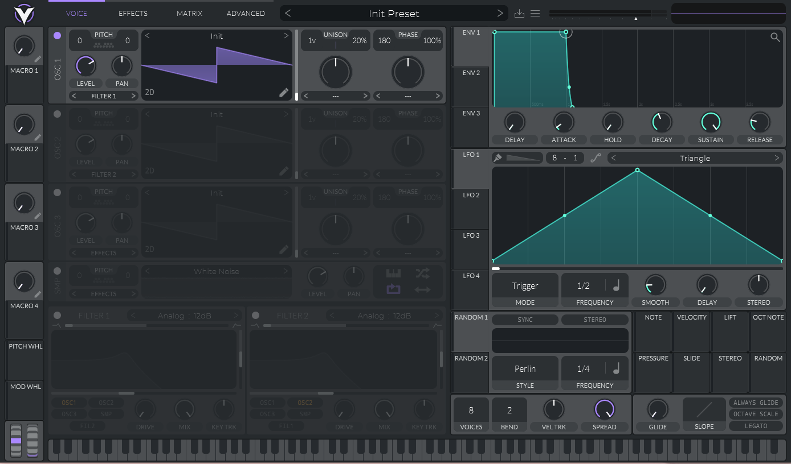
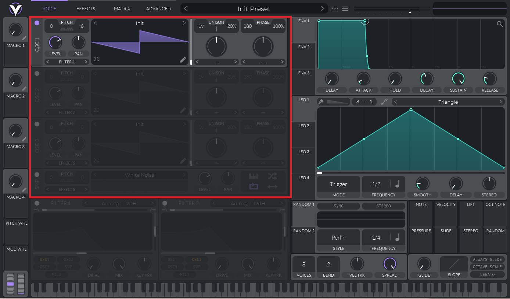
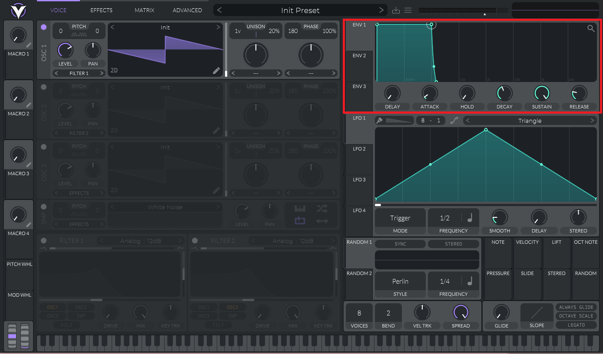
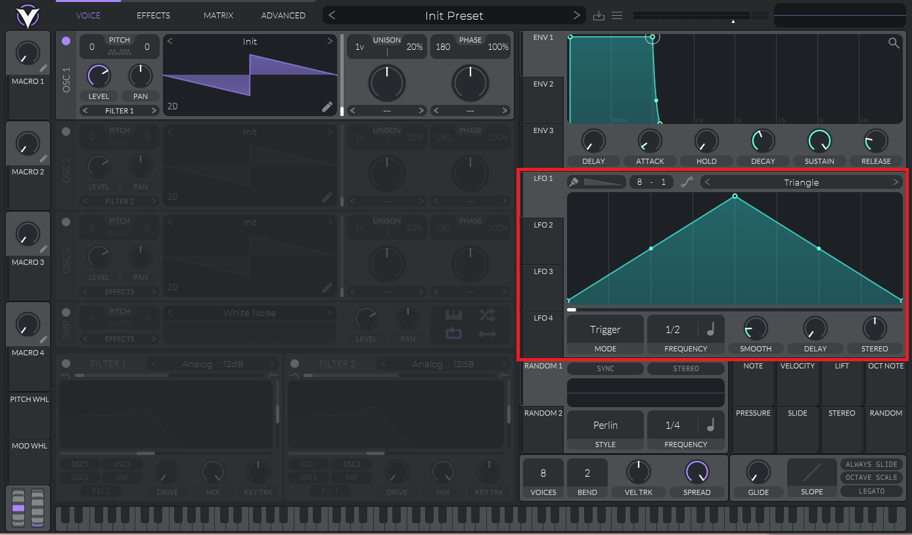
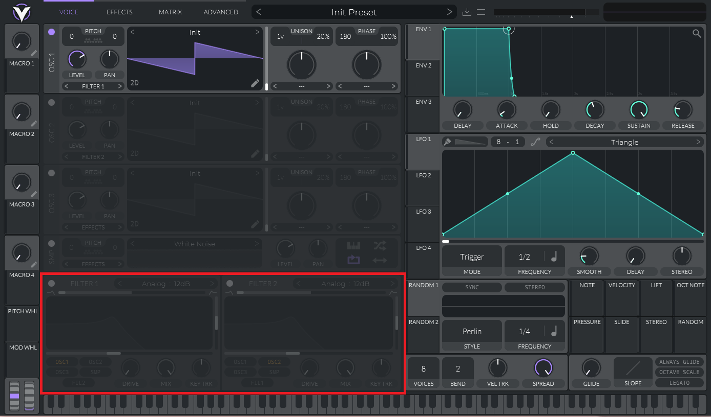
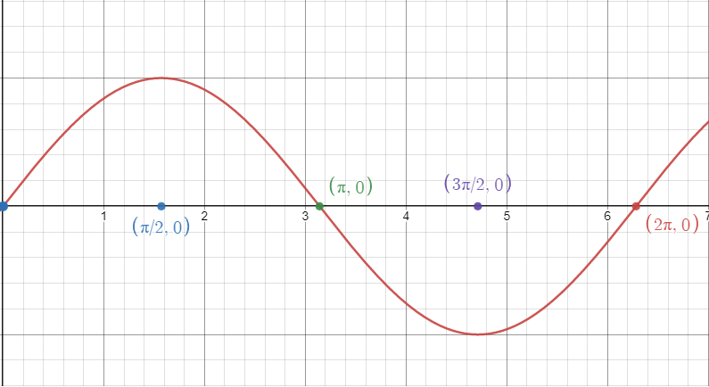

# ソフトウェアシンセサイザを作ってみよう

<span class="author">Nagaso.cpp</span>

## はじめに
  
こんにちは。6期生の Nagaso.cpp です。昨年に引き続き部誌の執筆に参加しました。  
今年はソフトウェアシンセサイザの自作に挑戦してみました。趣味の DTM でプラグインシンセサイザをいじっているうちに自作したくなったので、簡単なものを作ってみることにしました。

## シンセサイザとは？

シンセサイザとは、電気が持つ波を変換にして音にし、それを組み合わせて様々な音色を出すことのできる電気楽器です。エレキギターやエレクトリックピアノも電気楽器ですが、これらは発音自体はアコースティック（「音を鳴らす」という行為自体には電気を要さない）なのに対して、シンセサイザは発音にも電気を使うという特徴があります。具体例として、DTM での作曲に用いられるプラグインシンセサイザ「Vital」を見てみましょう。



こちらが Vital の画面です。この画面を参考に、シンセサイザの主な機能を見ていきましょう。



左上ではオシレータの設定をすることができます。オシレータは音の元となる波形を作りだすものです。波形には様々な種類があり、サイン波やのこぎり波、パルス波などがあります。この波形を更に細かく弄ったり、その他様々なパラメータを弄ったりすることができます。



右上ではエンベロープの設定をすることができます。エンベロープは、以下の6つのパラメータを変更することで、オシレータで設定した音の鳴り方を調整することができます。

- DELAY  
音の入力があってから音が鳴り始めるまでの秒数を設定できます。

- ATTACK  
音の入力があってから最大音量に達するまでの時間を設定できます。何も弄らなければ鳴った瞬間に最大の音量になります。

- HOLD  
最大音量になってからその状態をキープする秒数を指定できます。

- SUSTAIN  
音を鳴らし続けた時に最終的に到達する音量を設定できます。例えば、ピアノは鍵盤を押し続けると減衰して音は聞こえなくなるので、SUSTAIN は0になります。

- DECAY  
SUSTAIN で設定した音量に達するまでの時間を設定できます。

- RELEASE  
音の入力が終わってから完全に音が消えるまでの時間を設定できます。



右側の真ん中では LFO の設定をすることができます。LFO は Low Frequency Oscillator の略で、その名の通りオシレータの一種ですが、通常のオシレータとは違い 4Hz 程度の低い周波数の音を出します。こちらも波形を弄ることができ、オシレータやフィルタなど様々な部分に細かな変化を生み出し、音に動きを作り出すことができます。



左下ではフィルターの設定をすることができます。フィルターは鳴っている音の高域あるいは低域の周波数の成分をカットして、音色を変化させることができます。

## 実装する機能

　さて、ここからは本題に入っていきます。さすがに Vital のような完璧なものを作るのは今の私の技術力では無理なので、オシレータ・エンヴェロープの2つの機能を搭載したシンプルなシンセサイザを作ることにしました。

- オシレータ
サイン波とのこぎり波の2つを実装し、切り替えられるようにします。また、Vital 同様波形を表示して視覚的に分かりやすくします。

- エンベロープ
DELAY 以外の5つを実装します。

## 使用する技術

言語：C++

フレームワーク：OpenSiv3D v0.6.9

## 音の波形を生成する

　シンセサイザは音の波形をこねくり回して音を鳴らす楽器ですから、まずは波形についていくつか知っておきましょう。以下は ``y = sinx`` のグラフです。



このグラフの周期は 2π ですが、この0 ~ 2πまでの形が一秒間に何回繰り返されるかを表す数を**周波数** (frequency) といいます。この値が大きければ大きいほど、高い音になります。
また、グラフの中心から最大変位までの差 (今回であれば1ですね) を**振幅** (amplitude) といいます。この値が大きければ大きいほど、大きな音になります。

これらを踏まえたうえで、Siv3D 上で音声波形データを生成していきます。

### 音声波形データを生成する

　Siv3D で音声波形データを生成するには、``Wave`` クラスを使用します。``Wave`` クラスは ``WaveSample`` という 「``double`` 型の（端的に言えば）そのタイミングにおける音の大きさを表す値」を配列として保持します。配列なので宣言時には要素数を指定する必要があります。これは波形の秒数とサンプリング周波数の積で算出することができます。よって、``Seconds`` 秒の ``Wave`` は、サンプリング周波数を ``44100Hz`` (これは Siv3D 側に ``Wave::DefaultSampleRate`` として用意されています) として以下のように表すことができます。

```cpp
const auto lengthOfSamples = Seconds * Wave::DefaultSampleRate;

Wave wave(lengthOfSamples);
```

この ``wave`` の各要素に対して、音量を指定していきます。for 文を回して ``wave`` の各要素にアクセスしています。

```cpp
wave[i].left = wave[i].right = static_cast<float>(w);
```

``WaveSample`` は左右両方の音量を持つ値なので、両方指定します。今回はパンを振る予定はないので、両方同じ値にします。この音量を ``w`` で表しています。実装の都合上、``w`` は ``double`` 型にしているので、``float`` 型に変換しています。
そして、この ``w`` で表された音量は、波形のグラフで指定します。今回はサイン波を想定しています。

```cpp
const double sec = 1.0f * i / Wave::DefaultSampleRate;
const double w = sin(Math::TwoPiF * frequency * sec) * amplitude;
```

``sec`` は波形が再生されてからどれくらい時間が経ったのかを表しています。``Math::TwoPiF`` は ``2π`` を表していて、周期が 2π 、周波数が ``frequency`` 、振幅が ``amplitude`` のサイン波の ``sec`` における座標を ``w`` に代入しています。

## エンベロープを作る

　エンベロープの部分を作っていきます。各パラメータ (Attack, Hold, Decay, Sustain, Release) は ``struct`` で以下のようにまとめて管理します。

```cpp
struct AHDSRConfig {
    double AttackTime = 0.1;
    double HoldTime = 0.1;
    double DecayTime = 0.1;
    double SustainLevel = 0.6;
    double ReleaseTime = 0.2;
};
```

エンベロープ本体を、``AHDSREnvelope`` クラスとして実装します。以降はこの中身を書いていきます。

```cpp
class AHDRSEnvelope
{
    // エンベロープの処理を書いていく
};
```

エンベロープでは、Attack、Hold、Decay、Sustain、Release の順に状態遷移して処理を行うようにします。まず、エンベロープの遷移状態を表す ``AHDSRState`` クラスを実装します。

```cpp
public:
    class AHDSRState
    {
        Attack, Hold, Decay, Sustain, Release;
    };
```

さらに、エンベロープ内で使用する変数を定義します。

```cpp
private:
    AHDSRState CurrentState = AHDSRState::Attack; // 現在のエンベロープの状態
    double ElapsedTime = 0.0; // その状態に遷移してからの経過時間
    double CurrentLevel = 0.0; // 鳴っている音の音量
    double ReleaseStart = 0.0; // AHDSRState が Release になったときの音量
```

ここからはエンベロープの各遷移状態における処理を書いていきます。これ以降は全て ``public`` です。 ``ADSRSConfig`` の各値と単位時間の値を表す ``DeltaTime`` を引数に持つ ``EnvUpdate``関数を定義します。 ``EnvUpdate`` 関数は、波形に遷移状態に応じた処理をするようにします。これを ``switch`` 文を使って実装します。

```cpp
void EnvUpdate (AHDSRConfig &ahdsr, double DeltaTime)
{
    switch (CurrentState)
    {
        // 遷移状態によって処理を分ける
    }
}
```

ここからは各遷移状態の処理を書いていきます。

Attack では、 ``CurrentLevel`` を ``AttackTime`` 秒かけて 0.0 から 1.0 まで増幅させます。Siv3D には、ベクトル A からベクトル B への線形補完ができる関数 ``Math::Lerp()`` 関数が用意されているのでそれを使います。

```cpp
case AHDSRState::Attack:
    if (ElapsedTime < ahdsr.AttackTime) // ahdsr.AttackTime 秒かけて増幅
    {
        CurrentLevel = Math::Lerp(0.0, 1.0, ElapsedTime / ahdsr.AttackTime);
        break;
    }
    // 処理がすべて終わったら各値を更新
    ElapsedTime = 0;
    CurrentState = AHDSRState::Hold;
    [[fallthrough]]; // そのまま Hold に移行する
```

Hold では、 ``CurrentLevel`` を ``HoldTime`` 秒の間 1.0 に維持します。

```cpp
case AHDSRState::Hold:
    if (ElapsedTime < ahdsr.HoldTime)
    {
        CurrentLevel = 1.0;
        break;
    }
    ElapsedTime = 0;
    CurrentState = AHDSRState::Decay;
    [[fallthrough]]; // そのまま Decay に移行する
```

Decay では、 ``CurrentLevel`` を ``DecayTime`` 秒かけて ``SustainLevel`` まで減衰させます。こちらも ``Math::Lerp()`` 関数を用いて線形補完します。

```cpp
case AHDSRState::Decay:
    if (ElapsedTime < ahdsr.DecayTime)
    {
        CurrentLevel = Math::Lerp(1.0, ahdsr.SustainLevel, 
                                    ElapsedTime / ahdsr.DecayTime);
        break;
    }
    ElapsedTime = 0;
    CurrentState = AHDSRState::Sustain;
    [[fallthrough]]; // そのまま Sustain に移行する
```

Sustain では、ノートがオフになるまで ``CurrentLevel`` を ``SustainLevel`` に維持します。

```cpp
case AHDSRState::Sustain:
    CurrentLevel = ahdsr.SustainLevel;
    break;
```

Release では、ノートがオフになったときに ``ReleaseTime`` 秒かけて ``CurrentLevel`` を 0.0 まで減衰させます。ReleaseTime 秒経ったら常に ``0.0`` を返すようにします。こちらも ``Math::Lerp()`` を用いて線形補完します。

```cpp
case AHDSRState::Release:
    if (ElapsedTime < ahdsr.ReleaseTime)
    {
        CurrentLevel = Math::Lerp(ReleaseStart, 0.0, 
                                    ElapsedTime / ahdsr.ReleaseTime);
    }
    else CurrentLevel = 0.0;
    break;          
```

最後に、処理が終わったら ``DeltaTime`` 秒だけ時間を進めるようにします。

```cpp
ElapsedTime += DeltaTime;
```

これで ``EnvUpdate()`` 関数の実装が完了しました。

最後に、ノートがオフになったときに ``CurrentState`` を ``AHDSRState::Release`` にするための ``NoteOff()`` 関数を実装します。

```cpp
void NoteOff()
{
    ElapsedTime = 0;
    ReleaseStart = CurrentLevel;
    CurrentState = AHDSRState::Release;
}
```

これで ``AHDSREnvelope`` クラスの実装が完了しました。全体像は以下の通りです。

```cpp
// AHDSR の初期値
struct AHDSRConfig {
    double AttackTime = 0.1;
    double HoldTime = 0.1;
    double DecayTime = 0.1;
    double SustainLevel = 0.6;
    double ReleaseTime = 0.2;
};

// AHDSR エンベロープ
class AHDSREnvelope {

public:
    // 遷移状態を表す State
    enum class AHDSRState {
        Attack, Hold, Decay, Sustain, Release
    };

    // ノートがオフになったときの処理
    void NoteOff()
    {
        ElapsedTime = 0;
        ReleaseStart = CurrentLevel;
        CurrentState = AHDSRState::Release;
    }

    // エンベロープの状態遷移
    void EnvUpdate (AHDSRConfig& ahdsr, double DeltaTime)
    {
        // 状態によって処理を分ける
        switch (CurrentState)
        {

        case AHDSRState::Attack:
            if (ElapsedTime < ahdsr.AttackTime)
            {
                CurrentLevel = Math::Lerp(0.0, 1.0, 
                                            ElapsedTime / ahdsr.AttackTime);
                break;
            }
            ElapsedTime = 0;
            CurrentState = AHDSRState::Hold;
            [[fallthrough]]; // そのまま Hold に移行する

        case AHDSRState::Hold:
            if (ElapsedTime < ahdsr.HoldTime)
            {
                CurrentLevel = 1.0;
                break;
            }
            ElapsedTime = 0;
            CurrentState = AHDSRState::Decay;
            [[fallthrough]]; // そのまま Decay に移行する

        case AHDSRState::Decay:
            if (ElapsedTime < ahdsr.DecayTime)
            {
                CurrentLevel = Math::Lerp(1.0, ahdsr.SustainLevel,    
                                            ElapsedTime / ahdsr.DecayTime);
                break;
            }
            ElapsedTime = 0;
            CurrentState = AHDSRState::Sustain;
            [[fallthrough]];

        case AHDSRState::Sustain:
            CurrentLevel = ahdsr.SustainLevel;
            break;

        case AHDSRState::Release:
            if (ElapsedTime < ahdsr.ReleaseTime)
            {
                CurrentLevel = Math::Lerp(ReleaseStart, 0.0, 
                                            ElapsedTime / ahdsr.ReleaseTime);
            }
            else CurrentLevel = 0.0;
            break;
        }

        // DeltaTime 秒だけ時間を進める
        ElapsedTime += DeltaTime;
    }

private:
    AHDSRState CurrentState = AHDSRState::Attack; // 現在のエンベロープの状態
    double ElapsedTime = 0.0; // その状態に遷移してからの経過時間
    double CurrentLevel = 0.0; // 鳴っている音の音量
    double ReleaseStart = 0.0; // AHDSRState が Release になったときの音量
};
```
