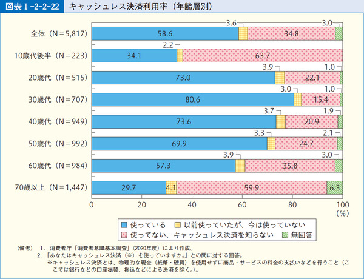
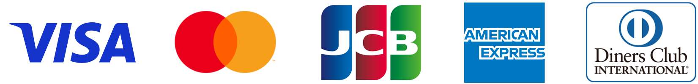

Chino Kafu

# 学生のキャッシュレス決済を考える

## はじめに - 学生こそ決済手段を意識するべきである

ラビットハウスからこんにちは。香風智乃です。キャッシュレス決済という言葉が持て囃されるようになって幾許かの年月が経ち，最近では田舎の小さなスーパーのレジにさえ「PayPay 使えます」の文字が小躍りするようになりました。現金主義が蔓延していた日本も，世界的なキャッシュレス化の風潮や，パンデミックという現金決済に大きな負のインセンティブを与える出来事の影響により，徐々にキャッシュレス化が進んでいると理解してよいでしょう。

しかしながら，10 代のキャッシュレス決済利用率は他の年代と比較して低い傾向にあります[^1]。恐らく「学生だからまだ要らない」とか「現金が減る感覚を知るべき」等と考えている人が多いのかと思います。

**しかし，果たして本当に学生にキャッシュレス決済は不要なのでしょうか?** 現金を取り扱うことによる負担は，現金決済者が想像している以上に大きいです。財布に紙幣と硬貨を入れて持ち運び，必要な金額を取り出してレジに出し，釣り銭を受け取りまた財布に収納するという手間が支払いの度に発生します。その上現金の出納は自分で記録しない限り全て不可視です。それらの負担を「学生だから」といって無条件に負い続ける理由はどこにもないのです。その上キャッシュレス決済を利用すれば，いつ，どこで，いくらお金を使ったのかが全て自動的に記録されます。手元にあるお金を把握することも容易で，支出の計画も立てやすくなります。我々は，年齢の如何に関わらずキャッシュレス決済を利用するべきなのです。

## キャッシュレス決済の種類

さて，一口にキャッシュレス決済といっても様々な手段があります。まずはその決済手段について理解する必要があります。

###  QR コード・バーコード

[PayPay](https://paypay.ne.jp/) が代表的な例です。店舗が提示するコードを読み取るタイプ (Merchant-Presented Mode, **MPM** ) と，客がコードを提示して店舗側が読み取るタイプ (Consumer-Presented Mode, **CPM** ) の 2 種類があります。MPM は決済速度が早いものの，店舗側の導入コストが高くなります。CPM は店舗側の導入コストは低いものの，客側が自分でコードを読み取るため少々手間がかかります (金額も客側が入力するケースが多いです) 。

支払い方法としては，事前に必要な金額を入金しておくプリペイド方式，利用時に銀行口座等から即時に引き落とされるリアルタイム方式，クレジットカードのように後から支払うポストペイ方式があります。大抵のコード決済はプリペイド方式とポストペイ方式を採用していますが，[Bank Pay](https://jeppo.jp/bankpay/) や[ゆうちょ Pay](https://www.jp-bank.japanpost.jp/kojin/sokin/yuchopay/kj_sk_yp_index.html) のようにリアルタイム方式を採用したコード決済も存在します。

近年目覚ましい成長を見せている決済方法です。

### 電子マネー

このネーミングが混乱を招いているような気がしてなりません。日本国内では「電子マネー」という言葉が，主に FeliCa を利用したカード型キャッシュレス決済手段に対して利用されているように見受けられます。つまり，Suica を筆頭とする交通系 IC カードや楽天 Edy， iD，QUICPay といったものです。

Suica や楽天 Edy はプリペイド方式で，iD や QUICPay はクレジットカードを紐付ける[^2]タイプになっています。10 代でも Suica を持っている人は相当数居るのではないでしょうか。Suica は電車に乗るだけでなく，コンビニ等でチャージしたり支払いに使うこともできます。

### クレジットカード

日本のキャッシュレス決済のほとんどを占める大御所です。ポストペイ方式で，基本的に 18 歳以上でないと作れません。ネットサービスなどはクレジットカード決済しか受け付けないものも多く，クレジットカードを持てない未成年はここでしばしば苦汁をなめることになります。

Visa や Matercard といった国際ブランドが介在することで，世界中のあらゆる加盟店で決済を行うことができます。

#### クレジットカードのタッチ決済

クレジットカードを非接触リーダにかざすことで支払う方法です。しばしば混同されるのですが，これは **iD や QUICPay とは異なるものです。**iD や QUICPay が利用する FeliCa と違い世界的に普及している NFC Type-A/B と呼ばれる技術を利用しているため，タッチ決済に対応している店舗では国を問わずに利用できます。まだ普及の過程にありますが，既に国内でもコンビニや大手チェーン店等はほとんどが対応しつつあります。カードをかざすだけなので，今までクレジットカードを利用する時に必要だったサインや暗証番号が不要になります[^3]。さらに，Google Pay や Apple Pay のタッチ決済に対応しているクレジットカードであれば，スマホでクレジットカード決済が可能です。筆者はこの「Google Pay / Apple Pay のタッチ決済」に対応しているか否かが，これからクレジットカードを選ぶ時の非常に重要なポイントであると考えています。

### ブランドデビットカード

ブランドデビットカードは，クレジットカードと同じように利用可能なリアルタイム方式のカードです。[ゆうちょデビット](https://www.jp-bank.japanpost.jp/kojin/cashless/yuchodebit/kj_cl_yd_index.html)や [SMBC デビット](https://www.smbc.co.jp/kojin/debit/) のように銀行のキャッシュカードに付帯していることが多いです。

クレジットカードと同じように Visa や Mastercard，JCB のような国際ブランドのカード番号が発行されるのでクレジットカードしか使えない場所でも利用可能です[^4]。

### ブランドプリペイドカード

ブランドプリペイドカードは，クレジットカードと同じように利用可能なプリペイド方式のカードです。[Kyash](https://www.kyash.co/) などが代表的な例です。

ブランドデビットカード同様，国際ブランドのカード番号が発行されます。

## 学生は何を使うべきなのか

ここまで主要なキャッシュレス決済手段についての簡単な説明をしてきました。では，学生はどの決済手段を使うべきなのでしょうか。以下では，決済手段を絞り込むいくつかの基準を記します。

### 目的を見失わない (重要)

あまりにも沢山の「キャッシュレス決済」が存在するものですから，次第に，ユーザーとしてもどれを選べば良いのかが分からなくなってきます。特にコード決済事業者などは，それぞれがユーザーを集めようと躍起になって，あの手この手で様々なキャンペーンを打ち出しています。すると，「お得感」にめっぽう弱い我々は，あっちのアカウントを作って，こっちのカードも発行して…… と無秩序に手を伸ばしてしまいがちです。しかし，我々は**キャッシュレス決済を利用する目的を見失ってはなりません**。その目的とは，

- 現金を取り扱う負担を軽減する
- お金の動きを把握しやすくする

に尽きます。キャンペーンや還元はあくまで副次的なもので，それらのために余計な複雑さを取り入れてしまってはキャッシュレス決済を使う意味がありません。現金の利用機会を減らせただけでも十分に儲けものだと考えるべきでしょう。

### 汎用性の高いものを選ぶ

どれほどよく出来た決済手段でも，1 つの店舗でしか使えないのであれば意味がありません[^5]。なるべく汎用性が高いものを選ぶことで，幅広いシーンで現金レスな生活を送ることができます。例えばコード決済なら J-Coin Pay より PayPay，カードの国際ブランドであれば American Express より Visa を選ぶといった具合です[^6]。

### 年齢を考慮する

学生にとって一つの壁となるのが年齢です。例えばクレジットカードは 18 歳にならなければ作れませんし，デビットカードも 15 歳以上という制限が課されている場合が非常に多くなります。近年は年齢制限の無いデビットカードやプリペイドカードも増えてきましたが，クレジットカードについては中学生・高校生が作ることはほぼ不可能です[^7]。

### フォールバック手段を意識する

当たり前のことですが，一つの決済手段のみに依存することは高いリスクを負うことになります。キャッシュレス決済が使えない事態に備えてフォールバック手段を用意する必要があります。最低でも，現金を持ち運ぶことは必要です。基本的に現金はどのような場所でも通用します。キャッシュレス決済を利用するからといって現金を持ち歩かない理由はありません。筆者は，異なる種類のキャッシュレス決済手段を合計で 2 つ，加えて現金があれば良いと考えています。

## 結論

以上の基準を踏まえて，筆者が学生に勧めたいキャッシュレス決済手段を紹介します。

### 住信 SBI ネット銀行のデビットカード

まずは[住信 SBI ネット銀行のデビットカード](https://www.netbk.co.jp/contents/lineup/debitcard/mastercard/)です。

私がこれを勧める第一の理由は，デビットカードとしては珍しく**年齢制限が無い**ことです。一般にデビットカードは 15 歳以上でなければ作れないことが多いですが，住信 SBI ネット銀行に関しては，親権者の同意を得れば口座開設・デビットカードの発行が可能です。

また，タッチ決済 (Mastercard コンタクトレス) に対応している上，**Google Pay / Apple Pay のタッチ決済も利用可能です**。これによって，タッチ決済に対応している店舗ではスマホをかざすだけで支払いが完了します。

また，スマホアプリの出来が非常に良く扱いやすいこともメリットです。学生が自主的に管理する財布代わりの口座として，こうしたネットバンクは非常に適していると言えるでしょう。

### PayPay

コード決済市場において圧倒的な地位を誇る PayPay は，やはりキャッシュレス生活を志向する上で欠かせない存在になってきます。他のコード決済が使えて PayPay が使えないという店舗は非常に少ないですし，PayPay のみに対応しておりクレジットカードが使えない店舗などもたくさんあります。もちろん PayPay には年齢制限も無いため自由に使うことができます。先述の銀行口座からチャージできるように設定すれば，なお有効に活用できると思われます。

以上の 2 つが，筆者が学生に勧めたいと考えるキャッシュレス決済手段です。どちらを主とするかは個人の好みに依りますが[^8]，この 2 つを利用していれば，キャッシュレス決済に対応している店舗であればほとんど現金を取り扱う必要がないはずです。学生の皆さんがキャッシュレス決済を有効活用し，手間を減らし，お金の動きを可視化し，快適な消費生活を送ることを切に願います。

## あとがきのようなもの

昨年に引き続き「パソコン部の部誌」には似合わない技術色の薄い内容になってしまいすみません。皆さんの作業ブランチを覗いてみるとしっかりとパソコン部らしいことをしていて肩身が狭い…… キャッシュレス決済も人々の生活を支えるデジタル技術の一環ということで，どうかご容赦いただければと思います。来年は Android アプリか Web アプリの開発に関する話を載せられれば良いなと思っています (一応構想があります) 。

そして部誌の発行に携わった方々へ。2 年連続で締め切りを大幅に超過してしまい本当に申し訳ありません。部長には大変なお手間をおかけしてしまいました。来年こそは締め切りまでに push できるよう努力する所存です。

[^1]: [第1部 第2章 第2節　(5)キャッシュレス決済に対する意識 | 消費者庁](https://www.caa.go.jp/policies/policy/consumer_research/white_paper/2021/white_paper_130.html#zuhyo-1-2-2-22)

[^2]: iD や QUICPay+ でデビットカードを利用することもできますが，長くなるため割愛します。

[^3]: その手軽さゆえ，タッチ決済のみで決済ができる金額には上限があり，それを越えるとサインや暗証番号の入力が求められます。日本の上限は 1 万円です。ただし，Apple Pay や Google Pay は，CDCVM と呼ばれる仕組みによりスマホ側の本人確認 (Face ID など) によって上限額を越えた支払いが可能になります。

[^4]: 実際にはクレジットカードとブランドデビットカードとブランドプリペイドカードは区別されていて，本当にクレジットカードを利用していないと弾かれることも稀にあります。

[^5]: 特定の系列店のみで使えるハウスマネーと呼ばれるキャッシュレス決済も存在しますが，これはもちろん汎用性に欠けるものとなります。

[^6]: 特定の決済方法を貶める意図はありません。あくまで市場シェアの話をしています。

[^7]: 高校 3 年生で 18 歳になればクレジットカードを作れるんじゃないか? と思うかもしれませんが，ほとんどのクレジットカードは高校生の発行を禁じています。恐らく唯一の例外として，セゾンカードは 18 歳以上であれば高校生でもクレジットカードの発行を認めています ([高校卒業予定の3年生の方も、WEBでカードをお申し込みいただけます | クレジットカードはセゾンカード](https://www.saisoncard.co.jp/topic/entry/voice_30/))。

[^8]: 筆者の個人的意見ですが，PayPay を主とする方が便利かもしれません。デビットカードは明細が届くまでに数日かかる場合があり，その間は店舗名が確認できません。PayPay であれば店舗名が即時反映され，管理が容易になるかもしれません。
