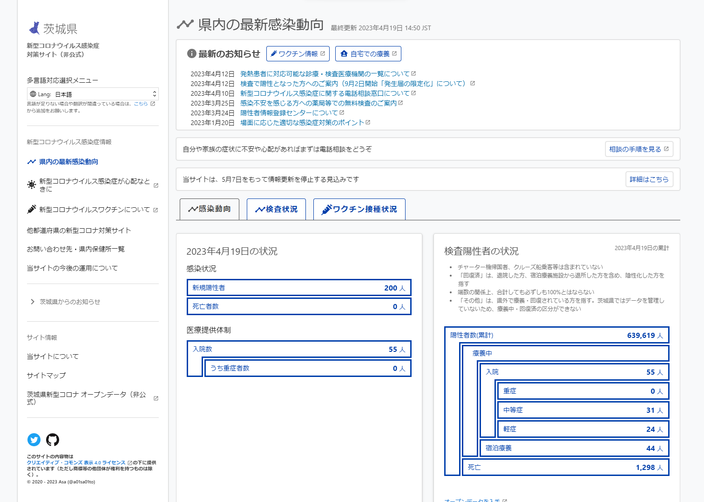
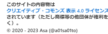
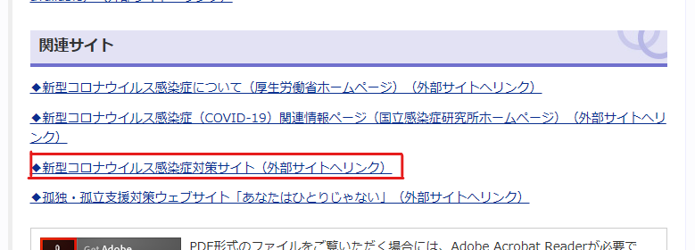
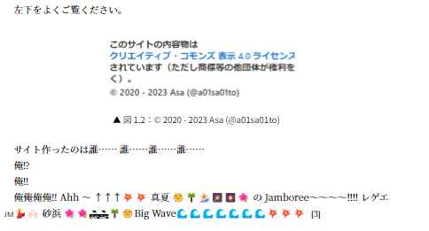

# COVID-19 Ibaraki (仮)

a01sa01to

## 雑談

こんにちは、古河中等 3 期生の a01sa01to です。誰やねんお前！については、プロフィール (別ページ) を見てください。

今年度は久しぶりのけやき祭一般公開、おめでとうございます 🎉
たぶん私も一般参加していることでしょう。
一般公開は私が 6 年次のときに一時停止してしまいました。生徒としての最終学年での文化祭ができず、かなしかった。
この度、2023 年 3 月中旬あたりにマスク着用が自由化され私ですか？花粉症がつらいのでマスク生活継続です、さらに 5 月には新型コロナに対する感染症法上の扱いが 5 類相当に移行したおかげか、復活してよかった～～！
文化祭に限らず、新型コロナに関しての規制がかなり緩和されて、どこでも人の外出が多くなったように感じます。
Q. なんでこんな雑談書いたの？ / A. 次ページに画像があって勝手に改ページされちゃうので、スペースを少しでも埋めたかった

 
<b>と　こ　ろ　で　、</b> 
新型コロナといえば、茨城県民なら一度はこちらのサイトを見たことがあるのではないでしょうか？ (誇張表現)

左下をよくご覧ください。

{width=250}

**はい、私が作りました。**

コロナも落ち着いてきて、対策サイトも終盤期(?) になってきた 終盤期というのは、5 類相当移行によってデータの毎日公表が終了するせいで、更新が頻繁に行われなくなるよというイメージです。少なくとも今のところサイト閉鎖のつもりはありません。 ので、私の作ったこの対策サイトの振り返りをしてみようと思います。

## やったこと

大雑把に書きます。

### 開発までの流れと初動

2020 年 1 月か 2 月、日本でクルーズ船の乗客で新型コロナ感染者が集団発生したというニュースが流れていました。
某先生が「こりゃ日本でも感染が広がって休校になっちゃうなぁ」と冗談っぽく言っていましたが、これが現実になります。彼はその後しばらく (一部)生徒の間で <b>予言者</b> と呼ばれていた

3 月から3 年前の記憶、あまり定かではないです休校になり、3 月 17 日ついに茨城県で初の感染者が確認されました。
そのころ、東京都がオープンソースで対策サイトを公開したことをニュースで聞いていましたが、調べてみると茨城県版はまだありませんでした。
こりゃ茨城県版も作ってみるかーと興味本位で、2020 年 3 月 20 日 Fork して 1 日かけて (逆に言えば、たった 1 日で) 作り終え公開しました。

初めて見た Nuxt.js (+ Vue.js) 、GitHub Actions などの技術が使われていましたが、何とか試行錯誤しながら作っていた覚えがあります。
当時の自分すごいな...。
たぶん最初のコミットは [3550a20](https://github.com/a01sa01to/covid19-ibaraki/commit/3550a20a43603903e719daac2a72afe68f7e8ab4) 。
うまくデプロイできず、リポジトリを作り直してファイルだけコピーみたいなことをしてました。
そのせいで、上のコミットは一括変更だし 大量の変更でのコミットは好ましくないといわれます。皆さんは一部変更するごとに (もちろん動作確認もして) Commit しましょう！！！ 、Fork 情報 GitHub 上のリポジトリ名の下に出てくる 「forked from ...」 みたいなやつ も消えています。
ここに最初のバージョンの画像を載せようとしたものの、Web Archive の読み込みがうまくいかず、諦めました。
興味があればビルドしてみてください。

そして初回 Release をします。
当時 GitHub の Release 機能や Git の Tag 機能について無知だったので、初回 Release は 3 月 24 日でした。https://github.com/a01sa01to/covid19-ibaraki/releases/tag/v1.0

やはり需要があったのか、 Google Analytics で見たところ、ピーク時には約 1 万 PV/日も！
2023 年 4 月 20 日現在、累計 100 万 PV を超えていたようです。ありがとうございます！
面白かったのは、感染者数の波と PV の波がきれいに対応していたこと。
最初のころと最近のころで感染者数が全然違うので、 $\log_{10}$(感染者数 + 1) のグラフと重ねてみました。
少し合成をミスったのでずれているように見えますが、この図を見ると、PV の増加と感染者数の増加はほぼ同じタイミングで起こっているように見えます。

2022 年 9 月下旬から Google Analytics のプロパティを変えたんですが、画像を重ねるのがめんどくさかったのでグラフは手書きです。
「ユーザー +1 万」「セッション +2.1 万」も 2022 年 9 月下旬からのものです。

ちなみに、一番閲覧が多かったのは「市町村別感染者数」。県のサイトは PDF 公開だし一覧表示されてなかったので、表で見れる対策サイトは需要が高かったっぽい。
また、GitHub 上でも、数週間で十数もの Star をいただきました。
初めてこのくらいの大きな反応になったので、やりがいとうれしさを感じました。

また、いろいろな方に開発を手伝っていただきました。
Issue でのアイデア出し、それにかかわる Pull Request などしていただきました！ https://github.com/a01sa01to/covid19-ibaraki/issues?q=is%3Aissue+is%3Aclosed
初動にいろいろご意見いただき、より良いサイトになったと実感しています。

### ドメイン変更

しばらく運用していると、一部の地域版が `stopcovid19.jp` のサブドメインを用いていることに気づきました。
調べてみると、東京都版対策サイトの開発元 [Code for Japan](https://www.code4japan.org/) が提供しているようでした。
`covid19-ibaraki.netlify.com` だとダサいので、Slack に参加し `ibaraki.stopcovid19.jp` ドメインを申請しました。
v2.0 https://github.com/a01sa01to/covid19-ibaraki/releases/tag/v2.0 で反映し、東京都版の派生サイトのファイルを変更する PR を提出しました。https://github.com/tokyo-metropolitan-gov/covid19/pull/3260
ついでに、開発用サイトのドメインも <https://covid19-dev.a01sa01to.com/> に変更しました。

このせいかコロナの波が来たせいか微妙ですが、PV の最初の波はこの時期です。

### 自動ツイート機能

やっぱり更新情報があったほうがいいよね、と思い実装してみました。
実装が楽そうな Python を用いています。
いろいろ文献があったので、参考にしながら (ほぼコピペ) 実装しました。

もともと私の個人Twitterアカウントでツイートしていましたが、さすがに専用アカウントを作りました。https://twitter.com/covid19_ibaraki
GitHub Actions でデプロイ完了時に「サイトを更新しました！」といった文をツイートするようにしました。
さまざまな要望に応えるためにツイート文に、今日の感染者数や重症者数などの情報を加えることも後日から行いました。

### 県公式サイトへの掲載

なんと、県公式サイトに掲載していただきました！

しかしここまでが長かったんですよねぇ...

経緯

🚧 To be written...

## おまけ

{width=400}

{width=450}

読み飽きないように、ところどころネタ要素を入れたかったんですが、NGになりました...。
