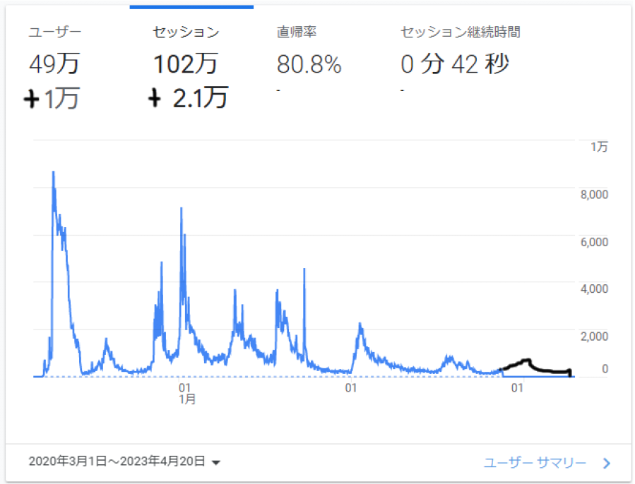

# 茨城県版新型コロナ対策サイトの振り返り

a01sa01to

## 前置き

こんにちは、古河中等 3 期生の a01sa01to です。誰やねんお前！については、プロフィール (別ページ) を見てください。アンケートで「青になりたいな～」と書いた人だったりするんですが、先日の ABC302 で入青しました！わーい！

今年度は久しぶりのけやき祭一般公開、おめでとうございます 🎉
たぶん私も一般参加していることでしょう。
一般公開は私が 6 年次のときに一時停止してしまいました。生徒としての最終学年での文化祭ができず、かなしかった。
この度、2023 年 3 月中旬あたりにマスク着用が自由化され、さらに 5 月には新型コロナに対する感染症法上の扱いが 5 類相当に移行したおかげか、復活してよかった～～！
文化祭に限らず、新型コロナに関しての規制がかなり緩和されて、どこでも人の外出が多くなったように感じます。Q. なんでこんな雑談書いたの？ / A. 次ページに画像があって勝手に改ページされちゃうので、スペースを少しでも埋めたかった

 
と　こ　ろ　で　、 
新型コロナといえば、茨城県民なら一度はこちらのサイトを見たことがあるのではないでしょうか？ (誇張表現)

左下をよくご覧ください。

{width=250}

**はい、私が作りました。**

コロナも落ち着いてきて、対策サイトも終盤期(?) になってきた終盤期というのは、5 類相当移行によってデータの毎日公表が終了するせいで、更新が頻繁に行われなくなるよというイメージです。少なくとも今のところサイト閉鎖のつもりはありません。ので、このサイトの振り返りをしてみようと思います。

## やったこと

大雑把に書きます。

### 開発までの流れと初動

2020 年 1 月か 2 月、日本でクルーズ船の乗客で新型コロナ感染者が集団発生したというニュースが流れていました。
某先生が「こりゃ日本でも感染が広がって休校になっちゃうなぁ」と冗談っぽく言っていたのですが、これが現実になります。彼はその後しばらく (一部)生徒の間で <b>予言者</b> と呼ばれていた

3 月から3 年前の記憶、あまり定かではないです休校になり、3 月 17 日ついに茨城県で初の感染者が確認されました。
そのころ、東京都がオープンソースで「新型コロナ対策サイト」を公開したことをニュースで聞いていましたが、調べてみると茨城県版の類似サイトはまだありませんでした。
こりゃ茨城県版も作ってみるかーと興味本位で、2020 年 3 月 20 日 Fork して 1 日かけて (逆に言えば、たった 1 日で) 作り終え公開しました。

初めて見た Nuxt.js (+ Vue.js) 、GitHub Actions などの技術が使われていましたが、何とか試行錯誤しながら作っていた覚えがあります。
当時の自分すごいな...。
たぶん最初のコミットは [3550a20](https://github.com/a01sa01to/covid19-ibaraki/commit/3550a20a43603903e719daac2a72afe68f7e8ab4) 。
うまくデプロイできず、リポジトリを作り直してファイルだけコピーみたいなことをしてました。
そのせいで、上のコミットは一括変更だし大量の変更でのコミットは好ましくないといわれます。皆さんは一部変更するごとに (もちろん動作確認もして) Commit しましょう！！！、Fork 情報GitHub 上のリポジトリ名の下に出てくる 「forked from ...」 みたいなやつも消えています。
ここに最初のバージョンの画像を載せようとしたものの、Web Archive の読み込みがうまくいかず、諦めました。
興味があればビルドしてみてください。

そして初回 Release をします。
当時 GitHub の Release 機能や Git の Tag 機能について無知だったので、初回 Release は 3 月 24 日でした。https://github.com/a01sa01to/covid19-ibaraki/releases/tag/v1.0

また、いろいろな方に開発を手伝っていただきました。
Issue でのアイデア出し、それにかかわる Pull Request などしていただきました！https://github.com/a01sa01to/covid19-ibaraki/issues?q=is%3Aissue+is%3Aclosed
初動にいろいろご意見いただき、より良いサイトになったと実感しています。

### ドメイン変更

しばらく運用していると、一部の地域版が `stopcovid19.jp` のサブドメインを用いていることに気づきました。
調べてみると、東京都版対策サイトの開発元 [Code for Japan](https://www.code4japan.org/) が提供しているようでした。
`covid19-ibaraki.netlify.com` だとダサいので (?) 、Slack に参加し幅広くいろいろな活動の情報が入ってきます。無料なので興味のある方はぜひ参加しましょう！！ <https://www.code4japan.org/activity/community>`ibaraki.stopcovid19.jp` ドメインを申請しました。
v2.0https://github.com/a01sa01to/covid19-ibaraki/releases/tag/v2.0で反映し、東京都版の派生サイトのファイルを変更する PR を提出しました。https://github.com/tokyo-metropolitan-gov/covid19/pull/3260
ついでに、開発用サイトのドメインも <https://covid19-dev.a01sa01to.com/> に変更しました。

このせいかコロナの波が来たせいか微妙ですが、PV の最初の波はこの時期です。

### 自動ツイート機能

やっぱり更新情報があったほうがいいよね、と思い実装してみました。
実装が楽そうな Python を用いています。
いろいろ文献があったので、参考にしながら (ほぼコピペ) 実装しました。

もともと私の個人 Twitter アカウントでツイートしていましたが、さすがに専用アカウントを作りました。https://twitter.com/covid19_ibaraki
GitHub Actions でデプロイ完了時に「サイトを更新しました！」といった文をツイートするようにしました。
さまざまな要望に応えるためにツイート文に、今日の感染者数や重症者数などの情報を加えることも後日から行いました。

### 県公式サイトへの掲載

なんと、県公式サイトに掲載していただきました！
しかしここまでが長かった...。

やっぱりこういった流行っている病の情報サイトは、多くの人に見てもらったほうが良いです個人の意見です。嘘の情報もあるので、一応信頼できるサイトだよ！という肩書きも得たかったのはあるかも。。
そのためには、県公式サイトに掲載してもらうのが一番です。
そこで、まず 2020 年 4 月中旬に県の問い合わせフォームに「掲載してください！実際にはもっと丁寧で詳細な文面ですが、概要はまさにこれです」と書き込みました。
返信が来ません。電話もしてみます。「部署が違う」ということで無限ループに陥りました。
学校の先生にも愚痴ります。県立とはいえ、何も起きません。
もう一回県の別の問い合わせフォームに別件付きで (後述) 書きます。
すると、メールで返信が来ました。今思えばやってることヤバいクレーマーじゃん...

そこから県の職員さんとメールでやりとり。
無断で県章を使っていた作成当時は「東京都が都章を使ってたし、茨城県版も県章使っちゃえ！」になってて、その後そのままにしてました。ちゃんと許可は取りましょう。ので変えてくれということで、茨城県の形をしたアイコンに変更しました。
そして、ついに掲載していただけることになりました。2020 年 10 月 1 日の出来事です。およそ半年かかりました。
ご対応いただいた職員の方に感謝です。

### オープンデータの公開

さっきの「別件」です。
オープンデータがあったら自動化できるな～と思って、公開しないのか聞いてみました。
回答は、主に「CSV ファイルで管理してないから」「個人情報が入ってるから」無理らしいです。 ~~まあつまり面倒くさいってことなんでしょうね...~~
そこで、私が作ったオープンデータなら公開しても構わないか訊ねてみたところ、OK が出ました。
そして作成に取り掛かります。

それまでは完全に手動更新でした。
VSCode を開いて、リポジトリ内にある `data.json` にその日の感染者情報やら回復者数やらを書き込んで、Commit する日々。例: 2020-10-28 の更新 <https://github.com/a01sa01to/covid19-ibaraki/commit/1ac96b1ad3e4b22dda35d7e08f6a8d2bf35b4f54>
当時は感染者数が Max でも 20 人くらいだったのでなんとか人力で耐えてました。
2020 年 11 月中旬から 60 人を超える波が来たので、タイミングが良かったなと思ったり。

ここからオープンデータにするために、データを移行します。
まず、この `data.json` から CSV 互換の形式に変換します。
どこにアップするかいろいろ踏まえた結果、 Google スプレッドシートに書き込むことにしました。
変換用に JavaScript で書いたスクリプトを実行し、コピペで完了しました。まあ「コピペで完了」と書いているわけですが、実際にはスプレッドシート作成が 8 月下旬、そこからどう保存するか、どう変換するか、...などいろいろ考えて、本格的に移行開始したのが 10 月くらいからなので、割と時間がかかってます。

とりあえず、スプレッドシートへの移行は完了したので、これをどうダウンロードするかを考えます。
毎回 CSV でダウンロードして、それを `data.json` に変換するのは面倒なので、Google Apps Script でスプレッドシートの内容を CSV としてダウンロードできるようにしました。
これで、 `data.json` の内容は自動取得できるようになりました。

あとは、自動更新のスクリプトを書くだけです。
これは GitHub Actions で定期実行するようにしました。
ファイルをダウンロードし、 Python で CSV から JSON にして、 `data.json` を更新するという流れです。
これで、 `data.json` 直書きからの脱却が完了しました。<https://github.com/a01sa01to/covid19-ibaraki/commit/babf65b980a880b6e2a59f69bc72d1ffd3e34292>
とはいえ、スプレッドシートの書き込みが手動です。
今後スクレイピングで自動化できるようになりますが、それまではまだほぼ手動更新です。<https://colab.research.google.com/drive/1WG6GD62sPMy-wkm457hFQf0wVuhUXUpL>

そして、一般公開のオープンデータの整備をします。
とりあえず自分のサイトで、ページを作って公開することにしました。

これでヨシ！と思った矢先、東京都版で高速化のために API を用いていることに気づきました。
具体的には、「陽性者の属性」を取得する API です。
これまでの陽性者のデータを埋め込んでいた `data.json` が日々肥大化していくので、読み込みが遅くなっていました。
私も茨城県版の少し様子を見ていましたが、 Loading にかなり時間がかかっていたので、茨城県版も API に移行することにしました。

いろいろ調べてみると、東京都版が用いている API では、GraphQL を用いていました。
GraphQL は、クライアント側で必要なデータを指定して、サーバー側でそのデータを返す仕組みです。
まあ同じような感じにしておいたほうがいいか...ということで、 GraphQL で API を書きました。
これが 2020 年 12 月くらいの出来事。
当初はサーバーサイドを JavaScript で書いていましたが、さすがに速度が遅すぎるので、少しずつ Golang に移行しました (完全移行は 2022 年 10 月ごろ)。
速度が速いとはいえ、めちゃくちゃナイーブな実装なので大量アクセスが来たら死にます 😇

## 反応

やはり需要があったようで、 Google Analytics で見たところ、ピーク時には約 1 万 PV/日も！
2023 年 4 月 20 日現在、累計 100 万 PV を超えていたようです。ありがとうございます！
面白かったのは、感染者数の波と PV の波がきれいに対応していたこと。
2020 年から 2023 年で感染者数がだいぶ変わってしまったので、 $\log_{10}$(感染者数 + 1) のグラフと重ねてみました。
少し合成をミスったのでずれているように見えますが、この図を見ると、PV の増加と感染者数の増加はほぼ同じタイミングで起こっているように見えます。

2022 年 9 月下旬から Google Analytics のプロパティを変えたためグラフが別になってしまったんですが、画像を重ねるのがめんどくさかったのでグラフは手書きです。グラフはほとんど合っているはずです。
「ユーザー +1 万」「セッション +2.1 万」も 2022 年 9 月下旬から 2023 年 4 月 20 日までのものです。

ちなみに、一番閲覧が多かったのは「市町村別感染者数」。県のサイトは PDF 公開だし一覧表示されてなかったので、表で見れる対策サイトは需要が高かったっぽい。
また、GitHub 上でも、数週間で十数もの Star をいただきました。
初めてこのくらいの大きな反応になったので、やりがいとうれしさを感じました。

## 対策サイトを支える技術

これまでの内容を見ればなんとなーくわかる気もしますが、 **現在の** 対策サイトを支える技術については以下のような感じです。

毎日の更新の流れとしては、まず私が (手動で) スプレッドシートを更新します。
更新が終わったら、「更新」ボタンを押すと GAS から GitHub Actions の Dispatch イベントを発火させます。
対策サイト、私のサイト、Opendata API の 3 つのリポジトリで発火された Actions では、それぞれスプレッドシート上のデータを GAS 経由で CSV/JSON 形式でダウンロードします。
その後、データを処理してサイトをビルドし、各々デプロイします。

対策サイトのユーザーは対策サイトにアクセスすると、必要であれば Opendata API からデータを取得します。
なお、Opendata API は Golang で構築されており、私のサイトから内部的にプロキシされています。
プロキシでの通信時間を考慮しても、API を JavaScript (Node.js) で作るよりかなり高速です。 ~~JS 遅すぎ！！~~

{width=100%}

## 振り返り

さて、ページ数も増えてきてしまったので、このあたりで振り返りとしたいと思います。
古くからプログラミングを行ってきましたが、このサイトで得られた知見はとても多かったですし、古河中等の校訓である「創造・挑戦・貢献」を中等生活で一番 学校側としてはあまりよくないかもしれないけど... 実践・体感できたと思っています。中でも、共同開発に必須な Git や GitHub、 npm をはじめとする、今後絶対に必要となるであろう技術等について学び、関連する分野でもより理解を深めることの後押しになったことは間違いないです。
最も、大学の授業や各種情報技術者試験において求められるような、かなり基礎的かつ重要で、しかも高度な知識を「習うより慣れよ」のスタンスで学ぶことができ、貴重な経験になりました！

みなさんも、積極的に何か作ってみてください！
「作るものがない！」という方は、いろいろな大会に出てみてください！！
JOI や ICPC などの競技プログラミングのほか、ISUCON や Web Speed Hackathon などのハッカソンもおすすめです！
「習うより慣れよ」です！！

最後まで読んでいただきありがとうございました 🙇

## おまけ

ちょっとページの余白があるので。

- ~~隠し要素があります。探してみてください。漢字に違和感があればたぶんそれです。~~ 「古河中等最高！」と縦読みを入れ込んだのですが、いざ製本するとずれてしまいました...かなしい（振り返り部分で「もっとも」を「最も」としたのはこのためで、typo ではないです）

- さすがに NG が出てしまった原案をお納めください。

{width=400px border=1}
