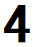

# 「文字の自動生成の仕組み」について

Kikuchi Hiromu

## はじめに

今回、文字の自動生成について書き綴っていきます。まず、文字の自動生成とは何でしょうか。
これは、簡潔に言うとAI（人工知能）がフォントを作ることと言えるでしょう。

フォントとは従来、人の手によって一つ一つデザインされていました。そのため、日本語のフォントを作るのに膨大な時間を要していました。
英語圏のフォントと比べるとわかりやすいと思いますが、日本語には漢字、カタカナ、ひらがなと文字の種類がとても多いです。
フォントを作成するにあたって、人手と時間がかかるとなると、フォントの種類は決して豊富といえるほどなく、利用するのにもお金がかかります。

このような背景があり、フォント作成をAIに任せることができるのであれば任せたいという考えから、文字の自動生成が研究され始めました。
そして、私はそこに興味を持ち、仕組みを調べました。
あわよくば、私自身でプログラムを書いてみたいと思っていましたが、仕組みを理解することは容易でありませんでした。
そのため、誰にでもわかってもらえるような説明をしていきたいと思います。

AIというと「万能」という印象があるかもしれませんが、実際には何もできません。少し言い過ぎたかもしれませんね。
それでも、最初は何もできません。何度も同じことを練習することで、ある特定のことができるようになっていくのです。
つまり、フォントを書くためには、文字をどう認識するのか、文字をどう装飾してフォントにするのか、というようにいくつかの段階を踏んで、最終的な目的のAIが出来上がります。
このことを頭の片隅に入れながら読んでいただくとわかりやすくなると思います。

## 文字をどう識別するのか

「文字」といってもたくさんの種類があります。
今は何もわからないため、まずは「数字」に絞って教えることにしましょう。
数字であれば、０から９までの10文字しかありません。

これから、私はパソコンを通してAIに数字の識別を学習させていきます。

まず初めに、ある1つの数字をAIに渡してみましょう。
それは、手書きで書かれた「９」であるとしましょう。
すると、AIは認識、思考、識別の過程を踏んで、「４」と答えました。

誰でも最初はまちがえるものですよね。
これを正しく答えさせるようにするにはどうすればいいでしょうか。
一つ一つ順を追って教えるため、「認識」、「思考」、「識別」の３つに分けて教えましょう。

### 「認識」

認識とは言いつつ、AIにはコンピュータを通して教えているので、データの形で判断してもらう数字を渡すしかありません。
また、AIは人間のように目で見ることはできません。
ではどうするのかというと、受け取った数字のデータを、縦横同じ数のピクセルで分割し、それぞれのピクセルに記録されている、白から黒のグレースケールでデータを数値化します。
いきなり言われてもよくわからないと思うので、図を用いて補足します。

{width=130}

{width=130}

文字を拡大してみると、グレースケールのドットで文字が構成されていることがわかります。
つまり、文字を細かい正方形で切ると１ピクセルになり、そのピクセルには、白を０、黒を１とすると、０から１の濃さで表すことのできる色がついています。

このとこから、AIが数字を認識するとは、ピクセルの順番とその色の値（０から１）記録することです。
数字も文字も同じ方法で認識できます。

### 「思考」

AIが文字を認識すると、これは何の数字であるか考えます。
もし、人もAIと同じように数字をこまごまに分けた状態であるピクセルに分けられたら、なんの数が書かれているのか気づけないでしょう。
数字を認識するには、ある程度ピクセルよりも少し大きなまとまりで数字を認識しているはずです。
つまり、認識したデータを組み合わせて小さな塊をいくつか作ることで、思考します。
具体的にどう考えているのかを目に見える形で表すことは難しいです。
そうとはいってもAIが考えることはすべて数式になっています。

### 「識別」

識別とは、AIが思考の末たどり着いた結果といえるでしょう。
頭の中で考えたことをほかの人に伝わるように考えをまとめ、わかりやすい形に直して結果を表します。
識別では考えた答えを整える程度のことしかしません。

このようにAIが学習するには、認識、思考、識別を何度も繰り返すことで、コツをつかんでいきます。
正確には、正しく答えられるように主に思考の方法を少しずつ変化させ、正しく答えられるようにします。
そして、AIは漢字も同様に学習することで文字を識別することができるようになります。

## 学習プロセスの数式化

認識、思考、識別は、あくまでも人間の頭の中で起きていることです。
コンピュータは基本物事を２進数で把握し、常に計算しています。
そのため、先ほどのAIの学習プロセスである「認識、思考、識別」をニューラルネットワークと呼ばれる数式で表さなければいけません。
少し説明を付け加えると、ニューラルネットワークとは、人間の思考プロセスを数式化したもので、AI学習の基本的な学習方法の一つです。

### ニューラルネットワーク

ニューラルネットワークは、「入力層、隠れ層、出力層」の三つからできています。
それぞれの層が、「認識、思考、識別」に対応するようにできています。
つまり、入力層では文字を識別するとことであり、隠れ層では思考し、出力層で文字を識別した結果を表します。
このことを数式に表したものが、ニューラルネットワークです。後々重要な基本的な考えになるので、一つずつ説明していきます。
入力層が認識、隠れ層が思考、出力層が識別に対応するようになっており、説明も対応させて書くので、見比べながら読むとより理解が深まるでしょう。

#### 入力層

ここでは、認識で説明したことを行います。
AIが手書き文字を受け取ります。この画像を数式的に表すことが目標です。
そのため、画像を28×28の大きさに区切り、一枚の画像を784ピクセルに分けます。
このピクセル一つ一つには、０から１の（白から黒に数字を対応させている）濃さで表すことができます。
そのため、一枚の手書き文字は、０から１の数値を784個並べたデータとして扱えます。

この入力層には784個のデータが入るように784個の数値が入るニュートロン（丸い容器のようなもの）があります。
そのニュートロンに一つ一つ数値を入れることで、手書き文字の認識ができます。

#### 隠れ層

入力層で認識したデータをあらゆる方法で思考します。
入力層は一つでしたが、隠れ層は何層にもなる場合があります。
３層以上になるとニューラルネットワークがからディープラーニングと言われているように、層が多いほどより複雑な処理、分析が可能になります。

#### 出力層

出力層で最終結果を表します。隠れ層で分析したデータをもとに、AIが導きだした答えをわかりやすく表現します。

### 精度向上

れまで一つの手書き文字を受け取るとAIがどのように答えを導き出すのかを説明してきました。
これからは、どのようにしたらより正しく答えられるようになるのかを説明します。つまり、AIの正確さを上げるためにすることがいくつかあるのです。

まず初めに、「重み」をデータの受け渡しの時につけます。
具体的に言うと、たいてい文字の場合ノートに書かれたマス目の真ん中に文字をかきます。
そのため、四隅には空白ができがちです。
つまり、マス目の真ん中にあるピクセルと四隅にあるピクセルを比べると前者のほうがより重要で、正解にたどり着くための鍵となりやすくなっています。
この状態が重いと表現しましょう。つまり、「重み」をつけるということは、その重みをつけたピクセルを強調することができます。
人間が無意識に重要な情報だけを考慮するように、AIにも重要な情報を「重み」をつけることによって、より考えやすくします。

この重みをデータの受け渡しの時につけるというのは、次の層にいくときそれぞれのニュートロンが持っている数値に重みをかけるということです。
ニューラルネットワークの図でニュートロン同士が線でつながっていますが、それが重みを表しています。
重みを別の言葉で表現するならば、重要度、伝わる速さとなるでしょう。
この表現を理解できるのであれば、重みを十分理解したといっても過言ではないでしょう。

この重みは自由につけることができますが、最終的な結果を大きく左右します。
これは重みが持つとても重要な性質です。なぜならば、重みを変数として扱うことで、AIの精度を上げられるからです。
しかし、ニューラルネットワークの図を見るとわかるように、線が重みであるので、たくさんの重みがあります。
これを一つ一つ変えて精度を上げるには、AIといっても膨大な時間がかかります。
ではどうするのでしょうか。その前に説明すべきことがあるので、また後で説明します。

### 損失関数

急に損失関数と言われましてもという感じですよね。
実はコスト関数とも言われることもありますといっても説明にはなりませんね。
損失関数とは、予想値と実際の値の差を測定する関数と定義しています。
つまり、AIが考えた答えが正しい場合、その差は０になります。
この差を０に近づけることが、AIの精度を上げることになります。
損失関数はいくつか種類があるため、状況に応じて使い分けます。

ここで重みが登場します。この損失関数の値を０に近づけることを目的に、重みの値を変化させます。
そしてこの時、勾配降下法というアルゴリズムを用いて、損失関数が０に近づく重みを決めます。

これでAIが文字を識別できるようにする学習方法とその精度向上の仕方を説明しました。
これでAIはようやく文字を認識できるようになりました。
次は、文字を書くことを教えます。ただ文字を書くのではなく、装飾的にフォントを作るイメージです。

## 文字をどう装飾してフォントにするのか

まず初めに、目的を確認しましょう。最終的な目的は、AIがフォントを自動で生成できるようにすることでした。
より砕けた言い方をすると、とある書体の文字をいくつか受け取り、それをもとに似た書体の文字（フォント）を作成することです。
ここには、受け取らなかった文字も、その受け取った文字の書体にしたフォントを作成することを含んでいます。
今まですべてをデザインしてフォントを作成していたことに代わって、いくつかの文字のフォントのデザイン案でほぼすべてのフォント完成させられることにするということです。

ではどのような学習をすればよいのでしょうか。今回は、その学習を行ってAIを学習させた「zi2zi」というプロジェクトで行われていることを説明していきます。

「zi2zi」というプロジェクトでは、実際に文字の書体変換をスムーズに行うことができています。
つまり、自動でフォントの作成をすることができているのです。ただ、文字の書体を変換するだけでなく、文字の太さもスムーズに変換できています。
これは、条件付き敵対生成ネットワーク (*Conditional Generative Adversaria Network*) というネットワーク構造になっているからです。今後CGANと呼んでいきます。

CGANを知らないからと言って、頭を抱えることはありません。
文字の識別を学習させるときに、ニューラルネットワークを用いました。
それと似たAIを学習させるネットワーク構造であるのがCGANです。
CGANとは、与えられた条件をもとに、その条件に応じた画像を生成することができます。
条件とは、手書き文字だと思ってください。そして、生成される画像がフォントです。
CGANによってフォントを作成することができるようになるので、文字をCGANについて説明していきます。

### Generator（ジェネレーター）

ジェネレーターは、ニューラルネットワークとほぼ同じ機能を持ちます。
つまり、ジェネレーターでは、手書き文字を受け取り、それに応じた文字を生成することができます。
CGANにはディスクリミネーターもありますが、実はジェネレーターだけで文字を生成することができてしまうのです。

それはさておき、ジェネレーターについてもう少し詳しく見ていきましょう。
ジェネレーターをさらに分けると、エンコーダー(Encoder)とデコーダー(Decoder)に分けられます。

エンコーダーは、手書き文字を受け取り、そこから特徴を抽出することをします。
文字を認識するのに必要な、ニューラルネットワークでいう入力層の役割を担っています。
それに加えて、手書き文字から特徴を抽出しますが、これは何でしょうか。
フォントを生成するためには、文字を書くことと、文字をどのように装飾するかを学ばなければいけません。
フォントを作成する際に、文字の形を知り、どう装飾するか（書体の違い）を知らないとフォントを作れないからです。
そのため、特徴を抽出するということは手書き文字から、「文字の形」とその文字の「書体」（どう装飾的に書かれているか）のコツをつかむというような感覚ですが、別々に特徴を抽出します。
同じ字でも書体が違えば、フォントとしては異なります。
そのため、入力層と同等の役割を担うエンコーダーは、字形の特徴を抽出する「コンテンツエンコーダー」と書体の特徴をつかむ「スタイルエンコーダー」の２つがあります。
それぞれのエンコーダーは、手書き文字を特徴ベクトルに変換して、次にデータを受け渡します。
特徴ベクトルとは、手書き文字を数値に変換した膨大なデータと思ってください。
ちなみに「ベクトル」というと、向きと大きさを持った値というイメージが強いですが、数学的な「ベクトル」は、行列と同義であるでしょう。
つまり、データの羅列で多次元にわたる数値を持っています。

デコーダーは、文字画像を生成します。ニューラルネットワークでいうところの出力層です。
デコーダーには、エンコーダーで抽出した２つの特徴を混ぜてから、画像を生成しています。
その２つの特徴を混ぜるところを、ミキサーと呼びます。
エンコーダー、ミキサー、デコーダーの順に並んでいます。
この並びとそれぞれの役割を考えると、入力層、隠れ層、出力層を連想してしまいますね。

### Discriminator（ディスクリミネーター）

ディスクリミネーターは、ジェネレーターで生成した画像が本物に似ているかどうかを判断する役割を担っています。
ジェネレーターで生成されたフォント画像は、何もしないとフォントではなくただの画像程度で、文字として日用使いすることは難しいでしょう。
ディスクリミネーターはジェネレーターで生成した画像が、どれくらい受け取ったデータ（本物）と比べます。
そして、違うところを指摘します。この過程は、ニューラルネットワークにあった損失関数と似ています。
しかし、実際にはディスクリミネーターは違いを指摘しません。生成された画像と受け取った画像を見せられ、どちらが本物かを見分けるのです。
このとき、エンコーダーは自分で生成した画像をデコーダーに選んでもらえるように（デコーダーをだますと表現することもできますが…）努めています。
このことから、CGANはエンコーダーとディスクリミネーターが切磋琢磨しあうことで、生成されるフォント画像の精度が向上していくことを可能としてくれます。

## 文字の自動生成の結果

今まで説明したことがプログラムに組み込まれています。
コンピュータでさえも膨大な時間がかかるため、できるだけ効率化した計算等を行っています。
しかし、その効率化した計算式が難しいため、説明は省かせていただきます。
このことに興味がない人は、AIが自動生成した文字は実際のところどれだけ正確なのかをご覧になって下さい。
この画像は「zi2zi」プロジェクトの結果報告の一部です。
気になる方に限らず、本研究をぜひともご覧になってください。

左がもともとの字（グランドトゥルース）、右が推測された字（生成画像）です。

## あとがき

私が数年にかけて、理解しようと取り組んできたことをまとめました。
しかし、数式やプログラムのようなより専門的なことはまだ説明できる程十分に理解できていないため、重要な部分以外は説明で触れませんでした。

ですから、十分に理解することが難しかったり、逆にもっと知りたいと思ったりとこの記事を読んで様々な感想を持たれたと思います。
どちらの場合にも以下のサイトをご覧になるとより考えが深まると思います。ぜひ一度は訪れてみてください。

> 手書き文字認識 - https://nnadl-ja.github.io/nnadl_site_ja/chap1.html  
> 「rewrite」のプロジェクト - https://arxiv.org/pdf/1711.06454.pdf  
> 「zi2zi」プロジェクト - https://github.com/kaonashi-tyc/zi2zi  
> ニューラルネットワークとは何ですか - https://youtu.be/aircAruvnKk  
