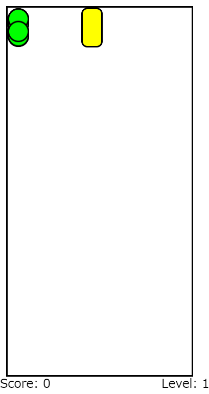
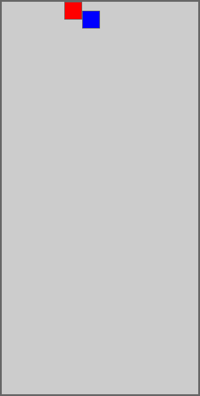
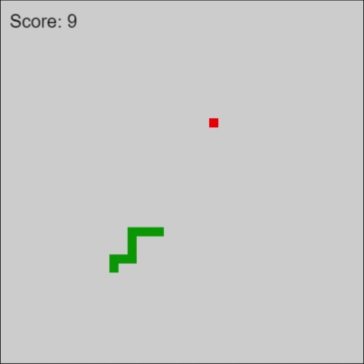
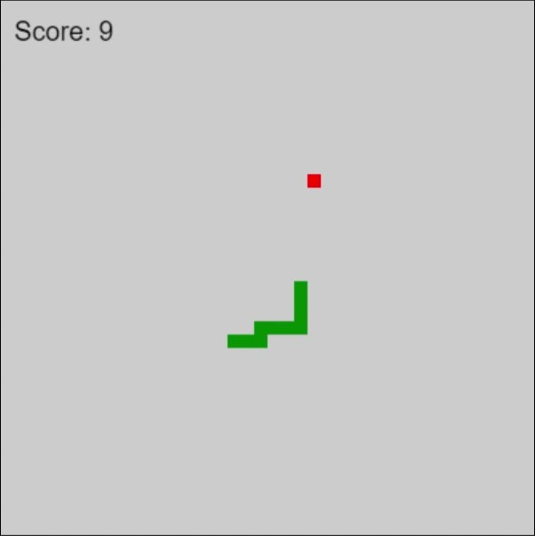

# AIと一緒にゲームを作ろう！

<span class="author">tarokko</span>

## はじめに

こんにちは。6期生の tarokko です。
先日、幕張メッセで行われたイベントのゲーム大会に行く機会があったのでニンテンドー3DSを持って行ったのですが、一日で12人のプレイヤーとすれ違いました。
まだすれ違い通信をすることがあるのかと感動した反面、3DSというハードの時代の終わりを感じ、名残惜しく感じました。

本章では他の変態たち(誉め言葉)の記事を読んでよくわからないと思った人にも読みやすいように心がけ、プログラミングに関する知識がない人向けに注釈を入れた記事を書いていきますので、ぜひ最後までお読みいただけると幸いです。

## AIについて

昨今のAIの発達は凄まじく、ニュースでも取り上げられることが増えてきました。
具体的には対話型AIの ChatGPT や BingAI 、画像生成AIの Midjourney や Stable Diffusion などが話題に挙げられることが多いと思います。
それ以外にも作曲AIや小説AIなどが存在し、ジャンルは多岐にわたっています。
本章では、対話型AIの ChatGPT が出力したソースコード<span class="footnote">コンピュータに命令を与える文字列のこと</span>でゲームを作っていきます。

## ゲーム制作においてのルール

ゲームを作っていく前にいくつかルールを定めていきたいと思います。

1. 無料版の ChatGPT(GPT-3.5) にコードを出力させる
2. 使用言語は JavaScript
3. 動作環境は JSFiddle
4. 基本的にソースコードはAIが出力した文章をそのまま使用する
5. ソースコードに含まれる数値は例外として人の手による変更を許可する

これらのルールを定めた理由は以下の通りです。

1. 無料版であれば誰でも同じ環境が使用できるため、真似がしやすいから 。また、インターネットに上がっている似たような記事では、GPT-4を使っている記事がいくつか見受けられたため、それらとの差別化のため。
2. 環境構築<span class="footnote">あるシステムやソフトウェアを実行するために必要な設定を行うこと</span>の必要がないから。
3. ブラウザで実行<span clasds="footnote">コンピュータプログラムをコンピュータ上で動作させること</span>できるサービスの中でも、使いやすく感じたから。
4. AIでゲーム制作をするという趣旨のもと、人の手による介入を避け、AIが出力したソースコードだけでゲームを作っていくため。
5. 主に座標の値をいじることにより見栄えを良くするため。

ルールについては以上ですが、以降の内容を読んでいくにあたって1点だけ頭に入れておいてほしいことがあります。
それは、私はJavascriptについての知識は全く持っていないということです。
それどころかプログラミングの経験は約5年前にC言語という言語に触れただけ~~であり、そのC言語の記憶すらとても怪しい~~という状況です。
これらを踏まえたうえで以降を読むことで、プログラミングの知識がなくても簡単なゲームが作れてしまう時代に入りつつあるいうことを実感していただけると思います。

## ゲーム制作

ここからゲーム制作に手を付けていきます。
制作に失敗したゲームについても書いてあるため、制作に成功したゲームだけを読みたい方は **3 スネークゲーム**まで読み飛ばしてください。

### ドクターマリオ

始めに目を付けたゲームは **ドクターマリオ** です。
このゲームについては以下の通りです。

> このソフトは、1990年に発売されたファミリーコンピュータ用のアクションパズルゲームです。
> ドクターとなったマリオの研究室のビンに発生した3種類のウィルスを、次々と投げ入れるカプセルを使って退治していきます。
> ウィルスは同じ色のカプセルを縦か横に4個以上並べると消えます。
> カプセルを回転させたり移動させたりしながら積み上げていき、ビンの中のウィルスをすべて退治するとステージクリアです。
> 
> *任天堂ホームページから引用*

ウイルスとカプセルをそれぞれ3色の記号で表すことができるため、このゲームを作れると思い、試してみました。
できたコードとその実行結果がこちらです。

```html
<!DOCTYPE html>
<html>
<head>
  <title>Doctor Mario</title>
  <style>
    #gameboard {
      position: relative;
      width: 240px;
      height: 480px;
      border: 2px solid black;
    }
    .virus {
      position: absolute;
      width: 24px;
      height: 24px;
      background-color: #00FF00;
      border: 2px solid black;
      border-radius: 50%;
      top: 0;
      left: 0;
      animation: virusMovement 0.8s ease-in-out infinite alternate;
    }
    .pill {
      position: absolute;
      width: 24px;
      height: 48px;
      background-color: #FFFF00;
      border: 2px solid black;
      border-radius: 8px;
    }
    .score {
      position: absolute;
      top: 490px;
      left: 0;
    }
    .level {
      position: absolute;
      top: 490px;
      right: 0;
    }
    @keyframes virusMovement {
      from {
        transform: translate(0, 0);
      }
      to {
        transform: translate(0, 24px);
      }
    }
  </style>
</head>
<body>
  <div id="gameboard"></div>
  <div class="score" id="score"></div>
  <div class="level" id="level"></div>s
  <script>
    (function () {
      const VIRUS_SIZE = 24;
      const PILL_SIZE = 24;
      const ROW_SIZE = 24;
      const CREATE_VIRUS_INTERVAL = 1000;
      const FALLING_INTERVAL = 500;

      let gameboard = document.getElementById("gameboard");
      let scoreElement = document.getElementById("score");
      let levelElement = document.getElementById("level");

      let score = 0;
      let level = 1;
      let virusCount = 0;
      let pillFalling = false;
      let pillInterval;

      let createVirusInterval;

      function createVirus() {
        let row = document.createElement("div");
        row.classList.add("row");
        gameboard.appendChild(row);

        let virusPosition = Math.floor(Math.random() * 10);
        for (let i = 0; i < 10; i++) {
          let virus = document.createElement("div");
          if (i === virusPosition) {
            virus.classList.add("virus");
          }
          row.appendChild(virus);
        }

        virusCount++;

        if (virusCount === 20) {
          clearInterval(createVirusInterval);
          pillFalling = true;
          pillInterval = setInterval(movePillDown, FALLING_INTERVAL);
        }
      }

      function createPill() {
        let pill = document.createElement("div");
        pill.classList.add("pill");
        pill.style.top = "0px";
        pill.style.left = "96px";
        gameboard.appendChild(pill);
        pillFalling = true;
      }

      function movePill(direction) {
        let pill = document.querySelector(".pill");
        let left = parseInt(pill.style.left);
        if (left + direction * PILL_SIZE < 0 || left + direction * PILL_SIZE > 216) {
          return;
        }
        pill.style.left = left + direction * PILL_SIZE + "px";
      }

      function movePillDown() {
        let pill = document.querySelector(".pill");
        let top = parseInt(pill.style.top);
        let left = parseInt(pill.style.left);
        let pillRow = Math.floor((top + PILL_SIZE) / ROW_SIZE);
        let pillColumn = Math.floor(left / VIRUS_SIZE);
        let pillBottom = (pillRow + 1) * ROW_SIZE - PILL_SIZE;
        let pillLeft = pillColumn * VIRUS_SIZE;
        let viruses = document.querySelectorAll(".row:nth-child(-n+" + pillRow + ") .virus");
        let virus = null;
        for (let i = 0; i < viruses.length; i++) {
          let top = parseInt(viruses[i].style.top);
          let left = parseInt(viruses[i].style.left);
          if (top === pillBottom && left === pillLeft) {
            virus = viruses[i];
            break;
          }
        }
        if (virus !== null) {
          gameboard.removeChild(pill);
          clearInterval(pillInterval);
          pillFalling = false;
          virusCount--;
          if (virusCount === 0) {
            level++;
            levelElement.innerHTML = "Level: " + level;
            createVirusInterval = setInterval(createVirus, CREATE_VIRUS_INTERVAL);
          }
        } else if (top + PILL_SIZE < 480) {
          pill.style.top = top + PILL_SIZE + "px";
        } else {
          gameboard.removeChild(pill);
          clearInterval(pillInterval);
          pillFalling = false;
          score -= 100;
          scoreElement.innerHTML = "Score: " + score;
        }
      }

      function startGame() {
        scoreElement.innerHTML = "Score: " + score;
        levelElement.innerHTML = "Level: " + level;
        createVirusInterval = setInterval(createVirus, CREATE_VIRUS_INTERVAL);
      }

      document.addEventListener("keydown", function (event) {
        if (!pillFalling) {
          createPill();
          return;
        }
        switch (event.keyCode) {
          case 37:
            movePill(-1);
            break;
          case 39:
            movePill(1);
            break;
        }
      });

      startGame();
    })();
  </script>
</body>
</html>
```

{width=350}

左上で絶えず生成される緑色のウイルス？達がぷかぷか浮いて、横に出現するカプセルが落ちるのをただひたすらに見守るゲームが完成しました。
ちなみにカプセルが一番下まで到達すると Score が -100 されます。~~個人的にはこれはこれで意味不明すぎて面白いのでアリ。~~

このあとも試行錯誤を重ねてみたのですが、残念ながらこれが一番まともなコードでした。作ることができなかった原因としては初期状態で発生するウイルスのコードを組むことが難しいからだと考えました。

### ぷよぷよ

ドクターマリオは諦め、次に**ぷよぷよ**を作ってみようと思いました。このゲームについては以下の通りです。

> 同じ色の"ぷよ"を４つつなげて消していくシンプルなルールで、行く手をはばむゆかいなキャラクターたちと対戦していくアクションパズルゲームです。
> 
> *セガ公式サイトから引用*

ウイルスという障壁がなくなったのでどうにかなるだろうと思い、試してみました。
できたコードとその実行結果がこちらです。

```html
<!DOCTYPE html>
<html>
<head>
  <title>Puyo Puyo</title>
  <style>
    #field {
      width: 220px;
      height: 440px;
      background-color: #ccc;
      border: 2px solid #666;
    }
    .block {
      width: 20px;
      height: 20px;
      border: 1px solid #666;
      box-sizing: border-box;
      position: absolute;
    }
    .red {
      background-color: red;
    }
    .green {
      background-color: green;
    }
    .blue {
      background-color: blue;
    }
    .yellow {
      background-color: yellow;
    }
  </style>
</head>
<body>
  <div id="field"></div>
  <script>
    const colors = ["red", "green", "blue", "yellow"];
    let currentPuyo = null;
    const field = [];
    for (let i = 0; i < 22; i++) {
      const row = [];
      for (let j = 0; j < 12; j++) {
        row.push(null);
      }
      field.push(row);
    }
    const fieldElement = document.getElementById("field");

    function render() {
      for (let i = 0; i < 22; i++) {
        for (let j = 0; j < 12; j++) {
          const block = field[i][j];
          if (block !== null) {
            block.style.top = i * 20 + "px";
            block.style.left = j * 20 + "px";
          }
        }
      }
    }

    function createPuyo() {
      const puyo1 = document.createElement("div");
      const puyo2 = document.createElement("div");
      const color1 = colors[Math.floor(Math.random() * colors.length)];
      const color2 = colors[Math.floor(Math.random() * colors.length)];
      puyo1.classList.add("block", color1);
      puyo2.classList.add("block", color2);
      puyo2.style.top = "20px";
      currentPuyo = [puyo1, puyo2];
      fieldElement.appendChild(puyo1);
      fieldElement.appendChild(puyo2);
      puyo1.style.left = "80px";
      puyo2.style.left = "100px";
    }

    function canMoveDown() {
      const [puyo1, puyo2] = currentPuyo;
      const [x1, y1] = getBlockCoords(puyo1);
      const [x2, y2] = getBlockCoords(puyo2);
      if (x2 >= 21 || field[x2 + 1][y2] !== null) {
        return false;
      }
      if (x1 >= 21 || field[x1 + 1][y1] !== null) {
        return false;
      }
      return true;
    }

    function moveDown() {
      if (!canMoveDown()) {
        fixCurrentPuyo();
        createPuyo();
        return;
      }
      const [puyo1, puyo2] = currentPuyo;
      const [x1, y1] = getBlockCoords(puyo1);
      const [x2, y2] = getBlockCoords(puyo2);
      field[x1][y1] = null;
      field[x2][y2] = null;
      field[x1 + 1][y1] = puyo1;
      field[x2 + 1][y2] = puyo2;
      render();
      setTimeout(moveDown, 500);
    }

    function getBlockCoords(block) {
      const top = parseInt(block.style.top);
      const left = parseInt(block.style.left);
      const x = Math.round(top / 20);
      const y = Math.round(left / 20);
      return [x, y];
    }

    function fixCurrentPuyo() {
      const [puyo1, puyo2] = currentPuyo;
      const [x1, y1] = getBlockCoords(puyo1);
      const [x2, y2] = getBlockCoords(puyo2);
      field[x1][y1] = puyo1;
      field[x2][y2] = puyo2;
      currentPuyo = null;
    }

    createPuyo();
    setTimeout(moveDown, 500);
  </script>
</body>
</html>
```


パッと見それっぽくはなりましたが、ランダムな色のぷよが生成されるだけのプログラムになってしまいました。何度実行してもぷよの色が変わる以外の変化はなく、このあと試行錯誤してもぷよが動くことはなかったです。

残念ながらこれも失敗に終わってしまいました。

### スネークゲーム

落ち物パズルは難しいと思い、作るゲームのジャンルを大幅に変えてみました。
Google で**ヘビゲーム**や**スネークゲーム**などと検索すると遊ぶことができるゲームを目標に作っていきます。

このゲームではプレイヤーがヘビを操作し、フィールドに存在するフルーツをたくさん食べることが目的のゲームです。
フィールドの壁やヘビ自身の体にヘビの頭が衝突するとゲームオーバーとなります。
また、フルーツを食べることでヘビの体が長くなり、だんだん難易度が上がっていくというものになっています。

これまでの2つのゲームでは「Javascriptで動く〇〇のコードを出力して」から始まり、何度も出力をさせた結果のコードを載せていたのですが、今回はなんと最初の出力でこのコードとその実行結果が出力されました。

```html
<!DOCTYPE html>
<html>
<head>
  <title>Snake Game</title>
  <style>
    canvas {
      border: 1px solid black;
    }
  </style>
</head>
<body>
  <canvas id="gameCanvas" width="400" height="400"></canvas>
  <script>
    // ゲーム画面の設定
    var canvas = document.getElementById("gameCanvas");
    var ctx = canvas.getContext("2d");
    var blockSize = 10;
    var width = canvas.width / blockSize;
    var height = canvas.height / blockSize;

    // スネークの初期位置
    var snake = [];
    snake[0] = {x: 5, y: 5};

    // フルーツの初期位置
    var fruit = {x: Math.floor(Math.random() * width), y: Math.floor(Math.random() * height)};

    // スコアとゲームオーバーの設定
    var score = 0;
    var gameOver = false;

    // ゲームループ
    function gameLoop() {
      if (gameOver) {
        return;
      }

      setTimeout(function() {
        requestAnimationFrame(gameLoop);
        draw();
      }, 100);
    }

    // 描画
    function draw() {
      // スネークの移動
      var head = {x: snake[0].x, y: snake[0].y};
      if (direction === "right") {
        head.x++;
      } else if (direction === "left") {
        head.x--;
      } else if (direction === "up") {
        head.y--;
      } else if (direction === "down") {
        head.y++;
      }
      snake.unshift(head);

      // フルーツを取得した場合
      if (head.x === fruit.x && head.y === fruit.y) {
        score++;
        fruit = {x: Math.floor(Math.random() * width), y: Math.floor(Math.random() * height)};
      } else {
        snake.pop();
      }

      // ゲームオーバーの判定
      if (head.x < 0 || head.x >= width || head.y < 0 || head.y >= height) {
        gameOver = true;
      }
      for (var i = 1; i < snake.length; i++) {
        if (snake[i].x === head.x && snake[i].y === head.y) {
          gameOver = true;
        }
      }

      // 背景を描画
      ctx.fillStyle = "#ccc";
      ctx.fillRect(0, 0, canvas.width, canvas.height);

      // スネークを描画
      ctx.fillStyle = "green";
      for (var i = 0; i < snake.length; i++) {
        ctx.fillRect(snake[i].x * blockSize, snake[i].y * blockSize, blockSize, blockSize);
      }

      // フルーツを描画
      ctx.fillStyle
      ctx.fillStyle = "red";
      ctx.fillRect(fruit.x * blockSize, fruit.y * blockSize, blockSize, blockSize);

      // スコアを表示
      ctx.fillStyle = "black";
      ctx.font = "20px Arial";
      ctx.fillText("Score: " + score, 10, 30);
    }

    // キーボード入力
    var direction = "right";
    document.addEventListener("keydown", function(event) {
      if (event.keyCode === 37 && direction !== "right") {
        direction = "left";
      } else if (event.keyCode === 38 && direction !== "down") {
        direction = "up";
      } else if (event.keyCode === 39 && direction !== "left") {
        direction = "right";
      } else if (event.keyCode === 40 && direction !== "up") {
        direction = "down";
      }
    });

    // ゲームを開始
    gameLoop();
  </script>
</body>
</html>
```





**ちゃんと動く！！！すげぇ！！！**

画像しか載せることができないというのがとても歯がゆいですがこのゲームの最低限のルールをおさえたコードが一瞬で出てきました。
そしてスネークゲームを作れというだけの命令だったにもかかわらず、出力されたコードにこれらの機能が実装されていたのには驚愕でした。

- ヘビがフルーツを食べるとScoreが増える点
- ヘビの体や壁に当たるとゲームが進行不能 = ゲームオーバーになる点
- コメントでそのコードが何を表しているか説明してくれている点

この後も改良を重ね、この記事の提出時点では、ゲームオーバーになったときにリトライするためのボタンの実装を完了させました。
文化祭当日ギリギリまで改良を重ねていきますので、ぜひ遊んでいただけると幸いです。

## おわりに

本章ではAIでゲームを作ってもらうことをテーマに、制作過程を紹介してきました。
しかし、AIでゲームが作れるからといってプログラミングの勉強をしなくてもよいかというと、実はそうではありません。
AIが生成するコードにもミスが含まれているため、それを修正できるほどの理解はしておくべきだと思います。

また、AIで生成したゲームを公開するときにも注意が必要です。
あくまでもゲームを作ったのは自分ではなくAIです。
ソースコードやゲームを公開する際にはそれを念頭に置いて、節度を守った利用を心がけるようにしましょう。

## 参考文献

- Introducing ChatGPT (https://openai.com/blog/chatgpt)
- jsfiddle (https://jsfiddle.net/)
- GPT-4を使って ぷよぷよ 作ってみたときの感想 (https://zenn.dev/corocn/articles/b4c473ed779935)
- GPT-4だけで作ったpackman… (https://twitter.com/shotyas/status/1636261249297297409?s=20)
- GPT-4に「ブラウザで動くテトリス作って」って言ったら一瞬でできた😮… (https://twitter.com/djrio_vr/status/1636230792799215616?s=20)
- ドクターマリオ｜Wii U｜任天堂 (https://www.nintendo.co.jp/titles/20010000003946)
- SEGA AGES ぷよぷよ (https://archives.sega.jp/segaages/puyo/)
