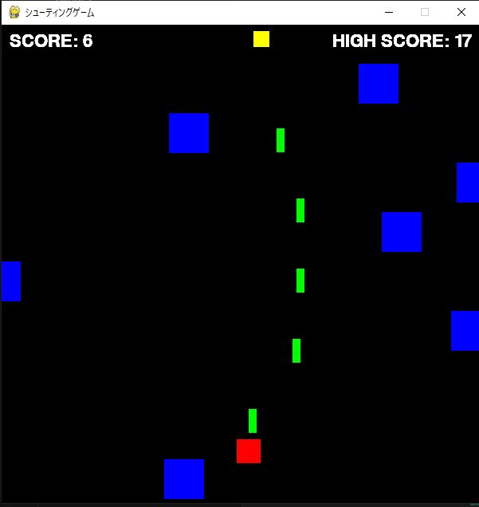

# 技術と人間 + pygameについて

<span class="author">Yowashita</span>

## はじめに

***97.3%***、皆さんはこの数字を見て何を思い浮かべるでしょうか。
このパーセントを見てこれだと即決できる人はいないでしょう。しかし、実はこれは皆さんの身近なものにかかわる割合なのです。もう少し考えてみましょうか。<br/>
･･･もう何か思いつきましたか？ では、正解発表をします。答えを言ってしまうと実はこれは2023年の高校生のスマホ所持率なのです。

このデータに従えば、仮にひとクラスに100人いたらそのうちスマホを持っているのはなんと97人という事になります。
どうでしょうか、人によってはこれでも少ないと思うかもしれません。全員スマホを持っているのが当たり前だと思う人も多いでしょう。しかし、スマホは誕生してからたったの29年しか経っていません。それなのにいまではこれほど私達の日常に浸透しているのです。
驚くべきことだと思いませんか？ まあ、とはいってもそう言ってる私はスマホを持っていないんですけどね。上記の例に従えば、私は100人の内の3人となります、すっごくレアな存在なんですよね。だからといって、別に家が貧乏からという訳ではありませんよ、パソコンは持っていますしね。では何故スマホを持っていないかと言うと私はそれを必要だとは思わないからです。その理由について次の章で述べたいと思います。


## スマホについて

確かにスマホは便利です。どこにいてもだれとでも連絡を取れますし、分からないことがあったら一瞬で調べることが出来ます。
暇な時には手軽にゲームをすることも、さらには勉強にも使えます。正直、この現代でスマホを持っていない高校生なんて頭おかしいんじゃないかとも自分でも思いますし。
実際、困ったことはたくさんありました。例えば外に行っても道が分からないとか、外で友達と連絡が取れないとか。一番困ったのは至る所で携帯電話番号を要求されることです。
LINEでもChatGPTでも、Googleアカウントの作成にも、様々なサービスを受けるためには私の持っていない電話番号が必要なのです。私はそれを持っていないばかりにGoogleアカウントを作るときに大変な思いをしました。
アカウントを作るにはGoogleから送られる認証番号を入力する必要があるのですが、それは通常、携帯電話番号にSMSという形で送られます。しかし、私にはそれがない。困っているとなんと流石は天下のGoogle様、家の電話番号を代わりに入力し、固定電話で知らせてくれる機能があったんです。
早速それを使い、電話がかかってくるのを待ちました。数秒後、受話器が鳴り、急いでとると、機械音声の無感情のトーンで「1･･･3･･･9･････」という風に認証番号が淡々と言われました。
携帯番号があったら入力するだけで済んだのにこんなめんどくさい遠回りを強いられたのです。このある意味貴重経験によっては私にスマホの必要を強く実感しました。
スマホがあれば、こんな経験をすることもなかったのに、当時はそう思ったものです。

しかし、これほど様々な不便を経験してもやはり結局私はスマホは持たない方がいいと判断しました。
何故か？ ちょっと極端かもしれませんけど、スマホは私にとって有害でしかないと様々な経験を通して感じたからです。
皆さんは経験したことありませんか？ スマホがなければって。 
周りの人から良くそんな話を聞きます。スマホがあったから勉強できなかった、スマホを見ていて事故にあった･･･、このような話を上げれば枚挙にいとまがありません。
ほとんどの人間はその本性が非常に弱いものです。近くに誘惑があればすぐそれに飛びついてしまう。完璧に自己を律せる人間なんてほぼいません。
スマホはそんな弱い人間を蝕む･･･行ってしまえば悪魔の道具です。スマホの悪影響について調べると次々出てきます。
鬱、依存症、睡眠時間の減少、放心･･･、有名な話ですが、かのスティーブジョブスは自分の息子にスマホを与えなかったそうです。その悪影響をだれよりも知っているから。
このように、ひとたびスマホの悪影響について調べたら、誰もがスマホを嫌うでしょう、しかしいったい何人がそれを手放せるでしょうか。これを読んでいるあなたもきっと、いや絶対捨てられないでしょう。
だったら最初から持たなければいい･･･なんてさすがに言いすぎですけど、まあそんな感じで私はスマホを持たないのです。
もう少し理由を上げるとスマホが高いからとか、思考力がそがれるからとか、スマホが高いからとか、スマホが高いからとか色々な理由があるんですけどね。
しかし、勘違いしないでほしいのは私はスマホを完全に嫌悪しているわけではないのです。今までめちゃくちゃ悪口を言ってきましたけどスマホが憎いわけではないのです。
悪いのはスマホと言う優秀な技術ではなく、それを使う人なのです。事故を完璧に律することが出来る人はいないと言いましたが、その努力をすることは誰でもできます。
結局のところ大事なのはスマホなどの技術との付き合い方なのです。


## 技術との付き合い方

今までの長い長い文章は前振りでここからが本題です。技術とは使う人によって毒とも薬ともなります。
例えばナイフを強盗と外科医に渡したとしましょう。同じナイフでも明らかにその使い方は両者で違くなるでしょう。
散々書き下ろしたスマホも同じです。人によって使い方は全く違います。一日中スマホを眺めて時間を無駄にしたと嘆く人もいれば、スマホに時間制限をかけるなどしてその影響を最小にとどめようとする人もいます。
しかしながら、私が思うに実際にスマホの影響を少なくしようとしている人はそれほど多くないと感じます。不思議なことだと思いませんか？
悪影響を認識していながらその対策をする人があまりいないなんて。私の無知のせいかもしれませんが、そのような物スマホぐらいだと思います。
ではなぜ一体そうなっているのでしょうか？ 様々な理由が考えられるでしょうけれども、私はスマホ・インターネットに対するルール作りがその技術の驚異的な発展速度に追いつけていなかったからだと思います。
最初に書きましたが、スマホは誕生してから29年しか経っていません。それなのに今はスマホが必要不可欠な時代になっているのです。
私が小学生の頃はスマホやインターネットに対する教育なんて全くありませんでした。中学生になってから少しずつスマホやインターネットに対する教育が進んできたという印象です。
つまり、この世代または前の世代はスマホに対して無知のまま生きてきたのです。
だからスマホの悪影響について知っても手放せない、それほど深刻なものと捉えられないから、況や知っていたとしてももはや生活の一部となっているスマホを今更切り離すのは難しい。
それが今の現状です。だからといってそのままにすればいいという訳ではありません。明らかな悪影響を前に何もしないのは愚か者のすることです。
この現状に対して必要なのはスマホに対する理解です。無知なら知ればいい、ただそれだけです。「スマホは絶対手放せないー」、「スマホは命よりも大事ー」、なんて浅いことを言ってる暇があるならその薄い板についての理解を深めてほしいです。
そうすることで、多少なりとも自分の現状を理解でき、自分にとって何が大切か分かるはずですから。

今の情報通信社会では技術の発展速度は歴史上類を見ないほどです。
だからこそ学校などの組織は技術に対応できない。だったら自分で調べるしかないのです。
最近話題になっているAIも同じです。AIの代表格となったChatGPTは人間と遜色ないレベルの知識を持ち、一億人以上の人が利用しています。
宿題の問題の解き方をChatGPTに聞けば完璧な答えがすぐに返ってきますし、なんなら人間顔負けのロールプレイもできます。
その高性能な機能を悪事に使う人も多く、AI賛成派と反対派で世界の世論は二分されており、多くの人はAI時代という新しい時代に少なくとも何かしらの恐怖を抱えています。
ではその恐怖はどこから生じるのでしょうか？ ･･･それは人々の無知から生じるのです。恐怖はたいてい無知から生じます。
暗闇を怖がるのもそこに何がいるか見えない、分からない、知らないから。AIを怖がるのもその実態が何で、どんな影響があって、私達にどんな変化をもたらすのか誰も分からないからです。
人々はそんな漠然としたイメージに怖がるのです。
だから、理解することが必要なのです。技術と付き合うためには正しい理解、知識が必要なのです。漠
然としたイメージの霧を晴らし、その正体を見極めることこそ大切なのです。折角あなたのポケットの中に世界の叡智へと導いてくれる道具があるのなら、それを使って霧を晴らすべきです。
それこそ有意義な使い方だと思いませんか？ 


## 最後に

これまでの話でスマホとAIを例に出しましたけど、驚異的な進化を遂げる技術は他にもあります。
例えばロボット、画像生成、IOT、クラウド、5Gコネクティビティ、ユビキタスネットワーク････数えればきりがありません。
この時代を生きているのは他人ではなく紛れもなくあなたです。
現代の、多くの情報が錯綜するこの世の中はまさに、情報が氾濫しているようなものであり、そのすべてが何のセーフティーもなく私達に降りかかってきます。
だからこそ、その情報の波に流されないようにするために私たち一人一人がそれらを取捨するという主体的な行動が必要です。
そのために正しい知識と理解が必要なのです。
そうすればどんな技術がやってきても上手く付き合うことが出来ますし、恐怖に陥ることもないでしょう。長々と書いて申し訳ありませんが、次の言葉で締めとしたいと思います。

> 「Knowledge is power (知は力なり)」 -フランシスコ・ベーコン 


## おまけ：pygameについて

締めにするとか言ったけど、それは前章までの話という事で、ここからはさっきまでの話とは全く関係のないおまけの話です。
ちょっとパソコン部として前の話だけではあれかなと思うのでこれをかくことにしました。すごく適当ですけど。
タイトルのpygameというのはPythonというプログラミング言語の中のライブラリです。
ライブラリと言うのは「ある目的のために機能をまとめたパッケージの総称」です。まあそれはどうでもいいのでこのpygameについて説明したいと思います。
これはPython環境下でゲーム開発を簡単にすることを目的に作られたライブラリです。実際にコードを書いてみます。

``` python
# 事前にパソコンに導入したpygameを読み込む
import pygame 

# 初期化する
pygame.init()

# スクリーンの大きさを決める
screen_width = 600
screen_height = 600

# リフレッシュレートの設定
FPS = 60
clock = pygame.time.Clock()

# 色
black = (0,0,0)

# ウィンドウの設定
screen = pygame.display.set_mode((screen_width,screen_height))
pygame.display.set_caption("ゲーム") # タイトルを決める

# メインループ
run = True #ゲームが動いている時
while run:
    # 背景
    screen.fill(black)
    
    for event in pygame.event.get():
        if event.type == pygame.QUIT: # ×マークを押したらゲームが閉じるようにする
            run = False 
        if event.type == pygame.KEYDOWN:
            if event.key == pygame.K_ESCAPE: # Escキーを押したらゲームが閉じるようにする
                run = False

pygame.quit()
```

このコードを実行したら


という黒枠が出てきます。はい、このコードはこれだけです。でも、これだけではなんにもできませんからここに様々な要素を付け加えます。
例えば操作できる自機を追加したり、敵を追加したり、弾を追加したり、スコア機能を追加したり。そうすることで1つのゲームを作ることが出来ます。
この要素の追加という点においてpygameは非常に便利なのです。キー入力の結果とから、スコアとか、最初からある程度の型が作られているのでゲーム開発がやりやすくなっています。
その機能を使って私も文化祭用にゲームを作りました。そのコードは400行近くあり長すぎるので書けませんが、代わりに画像を乗せたいと思います。



このように、自機と、そこから出る弾と、敵とスコアを追加して簡単なゲームを作りました。
時間がたつごとに敵の速度が上がるようにも設定しています。そして作ったゲームはそのままでもいいのですが、pyinstallerという別のライブラリを使うとexe化することが出来ます。
exe化とは「開発言語に依存することなくプログラムを実行できるようにしたもの」のことで、これを使うことによってPython環境のないパソコンでもゲームを動かすことが出来るのです。
実際私もノートパソコンで作ったゲームをexe化して学校のパソコンに入れました。

概要だけは説明したのでおまけはこんなもんにしたいと思います。pygameに興味を持ったという人は調べてみて、触ってみるのが一番でしょう。
習うより慣れよ、という事でこれで終わりにしたいと思います。ここまで読んでくださった人はありがとうございました。
