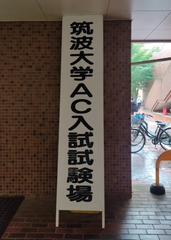

# ﾊﾟｿｺﾝｶﾀｶﾀしてたら大学合格した話 + 大学生活所感

Ryoga.exe

## はじめに

こんにちは、締め切りに大幅に遅刻した 5 期生の Ryoga.exe です。昨年度までこの古河中等に在籍していました。

今年度は久しぶりのけやき祭一般公開でかなり感動、嬉しみ。恐らく私も一般参加しているかもしれませんし、していないかもしれません。
全体集合 Ω の分割であり、情報量はない

この部誌という文化は私が昨年勢いで始めたものですが、今年も続いておりとても嬉しいです。やはり自分の言葉での情報発信はとても良いものだなと感じます。このような発信活動の場のひとつである本書を通して、読者のみなさまにも創作・技術に触れる楽しさ、好きなことに接する楽しさを感じてもらえると幸いです。

さて、私は今年の春に古河中等を卒業し、大学生になりました。
筑波大学情報学群情報科学類 (通称: coins) というところに入学してただいま絶賛学部 1 年生です。
昨年私は所謂「受験生」だったわけですが、アドミッションセンター入試 (AC 入試) と呼ばれる少々特殊な入試方式で受験し、まともな「受験勉強」をせずに大学に合格してしまいました。
一応後輩に私と同じ大学学類・同じ入学方式に気持ちのある方々がいるらしいのと、過去に古河中等から私以外で合格した人がいないので適当に書き残していきます。
今後、私のブログにも同じような文章が上がる可能性が高いです
ステッピングモータでとある曲を演奏してその様子を某動画投稿サイトに投稿したところ、かなり伸びたのでその記事にしようかと思ったが**なぜか**ストップがかかったためこんな記事になった

## 筑波大学情報学群情報科学類とは？

筑波大学は茨城県つくば市にある国立大学です。指定国立大学らしいです。
キャンパスがクソデカ東京ドーム 55 個分もあるだったり、広大な森だったり、他学群の授業を取り放題だったり、授業時間が 75 分でクソデカキャンパスを大移動するため休憩時間が 15 分～だったり、いろいろオープンにしていたり…調べれば調べるほど変わっている大学です。
情報系にいながら芸術の授業取れたり、体育ではメダリストから教えてもらったりできます、まじで総合大学。
さらには大学にいるのに隣の部屋からカラオケの音が聞こえてきたりして本当に変わっている大学です。
ちなみにマジです。私も大学でカラオケをしました。(あまり良くないことではあるけど)

筑波大学には以下の学群 (学部に相当) ・学類 (学科に相当) が存在します。

- 人文・文化学群
  - 人文学類
  - 比較文化学類
  - 日本語・日本文化学類
- 社会・国際学群
  - 社会学類
  - 国際総合学類
- 人間学群
  - 教育学類
  - 心理学類
  - 障害科学類
- 生命環境学群
  - 生物学類
  - 生物資源学類
  - 地球学類
- 理工学類
  - 数学類
  - 物理学類
  - 化学類
  - 応用理工学類
  - 工学システム学類
  - 社会工学類
- **情報学群**
  - **情報科学類**
  - 情報メディア創成学類
  - 知識情報・図書館学類
- 医学群
  - 医学類
  - 看護学類
  - 医療科学類
- 総合学域群
- 体育専門学群
- 芸術専門学群

文系理系から体育・芸術まで幅広い学問が学べる総合大学です。
この中で私が受けた情報科学類は情報科学について専門的に学べる学類で、つくばの強いオタクが多数在籍しているところとしても有名です。

以下に筑波大学公式サイト (https://www.tsukuba.ac.jp/education/organization-ug-list-0160/index.html) からの引用を載せます。

> **教育目標**
>  
> 情報に関わる先端の科学と技術の基礎から応用までを習得し、同時に豊かな想像力とチャレンジ精神、高い社会的倫理観を培う。
> これらを基に、実世界の様々な課題の本質を理解し、その具体的な解決にリーダーシップを発揮して、秩序ある情報化社会の実現に貢献できる技術者・研究者を育成する。
>  
>  
> **構成分野について**
>  
> 情報科学類には、ソフトウェアサイエンス、情報システム、知能情報メディアの3つの主専攻があります。卒業研究では、ソフトウェア科学、計算機システム、知能情報、情報数理、情報電子などの分野から提供される多様なテーマを選択できます。

## アドミッションセンター入試 (AC入試) とは？

総合型選抜のひとつで，筑波大学独自の入試です。
**AO** ではありません、**AC** です。
出身高校からの推薦は不要ですが、書類選考と面接が課せられることが大きな特徴です。

AC 入試では、「AC 入試におけるアドミッションポリシー」を満たしている学生を選抜します。
情報科学類における AC 入試では、

1. 第 1 次選抜: 「志願理由書 (800 字以内)」「自己推薦書 (枚数自由)」を提出
2. 第 2 次選抜: 第 1 次選抜の合格者に対し，口述試験 (面接) を行う。
3. 面接に合格した受験者が，AC 入試の最終合格者となる。(大学入学共通テストの受験は必要ない)

という感じの流れで行われます。

ちなみに AC 入試は専願することを宣誓するものではないため併願校として受験することもできます。また、現高 3 生・既卒生・社会人・高卒認定試験の合格者など、広く受験資格を持つことも特徴です。

## 受験を決めるまで

なぜ筑波大学情報学群情報科学類を選択し、その上で AC 入試を選んだかについて説明したいと思います。

### 推薦入試を決めるまで

古河中等 1 年次のころからプログラミングを行っており、情報系に気持ちがあったため中等入学当初から情報系学部への進学を考えていました。

4 年次のころに、競技プログラミングに出会い、5 年次になるにつれ情報科学という学問への興味がますます強くなりました。
特にプログラミングでものを「**作る**」という興味から「**研究する**」という興味に変わっていきました。
やはり研究するなら国公立大学だろう、と考え国公立大学への進学を視野に入れ始めました。
当時は国公立大学ならどの大学でも同じようなものだろうと考えていたため、「適当な国公立大学で情報系の学部」という志望をしていました。
最終的に志望校を決定したのは 6 年次の夏でした。
もちろん明確な志望校を決めていないなどと 5 年次での担任との面談では言えなかったので表向きには志望校を決めているふりをしていた

5 年次の冬頃、Twitter 上で AC 入試に合格した人を数人観測し、AC 入試の存在を知りました。
入試についていろいろと調べていくうちに面白そう！と感じ、決定まではいかなかったものの視野に入れていました。

6 年次に上がるにつれ受験への焦燥感が高まるも、受験勉強よりもプログラミングやらの方が楽しかったのでずっとパソコンの前にいました。

私は勉強があまり得意な人間ではなく、特に所謂受験勉強と呼ばれるような機械的に知識を詰め込む作業は苦手でした。
また、模試を受験すること自体に抵抗感があり苦手でしたし、学年全体にあった全体主義的な団体戦としての受験といった空気感が苦手でした。
なにより、一般入試のシステムや、大学受験に対する空気感・学歴に対して云々いう人々世間では学歴廚というらしい、クラスに数人いて始めはなんとも思わなかったがだんだんと苦しくなったが嫌いで、かなりストレスを感じていました。
そういうこともあり、「一般入試で合格するのは不可能ではないか」と感じていました。
というか嫌だった

そこで当然目を付けたのが「推薦入試」です。

### AC 入試を選択するまで

情報科学を学べて推薦入試を選択できる国公立大学を探すといろいろ出てきました。
調べていくうちに日本には主に学校型推薦と総合型選抜の 2 種類が存在するということを知りました。
ここで、
「学校でいろいろとやらかしていたり、未提出課題が溜まっていたり、何度か怒られが発生していたので学校からの推薦はもらえないのでは？それ以上に古河中等自体あまり好きではないので学校から推薦をもらって受験したくない！」
と思ったため、完全に総合型選抜にシフトしました。
また、前述したとおり勉強ができない (特に国語が壊滅している) ため、できれば共通テストを受験したくなかったと感じていたため、これらを前提に探しました。

調べていくうちに筑波大学の AC 入試を思い出し、かなり気持ちが強くなっていきました。
大学でやりたいことができそうだなと感じたのもかなり大きかったです。
また、筑波大学の情報科学類自体、授業や雰囲気が面白そうだなと感じ、行きたいなと思うようになりました。
情報系のコミュニティが充実している点がとても好印象で、特に jsys や WORD などに入りたい気持ちが高まりました。
その上、他学類の授業が取りやすいという点も理由としてありました。

以上のことから、6 年次の 3 月ごろに情報科学類へ AC 入試で合格した人とお会いし、いろいろと話をする機会があり、そこで詳しく知れたのも大きかった筑波大学の AC 入試の受験を決めました。
6 年次の 5, 6 月ごろでした。

ちなみに筑波大学の学校型推薦入試の方にも両方出願できるのですが、前述のことと AC 入試で入学すること自体に価値を感じていたためこちらの準備はせず、AC 入試のみに専念しました。

## 出願の準備

とりあえず、AC 入試で受験することなどを担任へ伝えました。またよくわからない書類に受験する旨を書いたりしました。
~~学校には秘密にして受験したかったのですが、調査書などの提出が求められるなどがあり無理らしい。~~

エントリーは Web 上で行います、私は 8 月 30 日の夕方に行いました。

### 志願理由書

coins のアドミッションポリシーを参考にして書きました。志望した理由と今までにやってきたことや、これからやりたいことを絡めて書きました。
学校で志望理由書を書く授業というかそんな感じのものがありましたが、そこで書いてみて返却された文章をもとに書き始めました。
ただ、ここで返却されたものはなんというかあまり的確な指摘・修正をしてくれなかったので微妙でした。
もちろん技術的なことを絡めて書いたわけですがそういったことに対するフィードバックはなんとも言えない感じでした。

同級生に知識情報・図書館学類 (klis) の AC 入試を考えている友人がいたなんと下の名前の読みが同じため、2 人で添削し合いました。
なんだかんだで仲間がいることは精神的にも重要
また、母にフィードバックをもらい、なんとか良い感じの文章に仕上げていきました。

ちなみに指定された形式の用紙に書くのですが、パソコン使用可であったため頑張って原稿用紙の枠に合うように調節して書きました。
PDF の形式でしか配布されていないため、非常につらいものがある
友人はなんと MS ペイントで作っていた

### 自己推薦書

提出する書類の中でこれがメインです。ページ数もフォーマットも自由です。100 枚以上書く猛者もいるらしいです。

私は以下のことを中心に書きました。これらを絡めて大学側から求められている**問題解決能力**を重視して書きました。

- 部活動での活動
- 開発したアプリやゲームについての話
- OSS への貢献活動
- 競技プログラミング・情報オリンピックへの参加
- 応用情報技術者試験の合格
- 情報科学の達人での学び・研究
- その他の活動 (文化祭実行委員やその他開発したもの・スキーなど)
- これから続けたいことや筑波大学でしたいこと

途中までは不安もあったのか思うように筆が進まずかなりまずかったです。

こちらに関しても前述した友人と添削し合ったりしました。なんなら推薦書に互いの名前を出しました。
2 人で進捗状況を確認したりできたのはかなり助かったです。
添削・進捗状況の確認以外に Python での自然言語処理を教えたりしました。

それに加えて、昨年度に AC 入試で合格した人からの添削をしてもらいました。
自己推薦書は内容が非常に専門的なことに傾くため、プログラマからの Lint はかなりありがたかったです。

最終的に書きあがったのが 9 月 2 日の深夜でした。

補足資料として作ったソフトウェアのソースコードや実行ファイル、動作している様子を収めた動画を USB メモリに入れて送りました。

## 一次選考結果発表

書類提出から一次選考結果発表まで 1 か月近くあるのでかなりメンタルがやられました。
ふらっと大洗に出かけて美味しい海鮮を食べたり、ゲームセンターに行き趣味の Chunithm やオンゲキをするなどして気分をリフレッシュしました。

選考結果については家で確認しました。普通に平日なのであまりよくはないが、万が一精神が終わるので家で見るのが平和だと思います…正直通るとは思っていなかったのでめちゃくちゃ声を出して喜んだ覚えがあります。心の準備ができてないまま間違えて適当なリンクをクリックしたらまさかの合格者一覧が出てきてでびっくりしたのもある

それからは二次選考である面接の練習をしました。担任の先生や、coins に AC で合格した先輩などに練習をお願いしました。本当にありがとうございました。
練習では自己推薦書の要約の練習をしたり、基本的な受け答えの練習、飛んできそうな質問について考えたりしました。

## 面接

前日はしっかりと早寝をしました。面接 1 時間前くらいに大学に到着しました。かなり着くのが早すぎたので待合室でかなり暇でした。

面接会場ではアクリル板がありましたが、次もあるのでしょうか…？

受験の雰囲気ですが、和やかだなと感じました。ほとんど雑談でした。
面接官は教授 2 人とアドミッションセンターの職員の方 1 人の計 3 人でした。
最初にアドミッションセンターの職員の方から緊張をほぐすような軽い雑談から始まり、教授からの質問に移って自己推薦書についてだんだんと掘り下げられていく…といった感じです。
ボケるとウケを取れるのでとても平和で、どっと笑いを起こせたので楽しかったです。
かなりの圧迫面接であったと言っていた人もいたので試験官や年度・学類によって変わるのかなと思います。教授と激しいレスバを繰り広げて合格している人もいるらしい

なにより、楽しむのが一番だと思います。楽しく話せたら受かっていると思います。

受験後は、「あーー落ちたなー」という気分で、ある意味開放的な気持ちになっていました。
そのまま大学周辺の二郎系ラーメンを食べたり、内見をしたりしました。

## 最終合格者発表

最終合格者発表の一週間前の時期はいろいろと精神が不安定でした。なんとか乗り越えましょう。
私の場合は Meta Hacker Cup 上位入賞者として T シャツが届いたり、PCK で会津に行けることが完全に確定したり、PG BATTLE でスポンサー賞になったりしたイベントがあったのでなんとかなりました。

発表前日、一次の時の私のせいかもしれませんが「合格発表は家で確認しよう！」と教室の連絡事項に書かれていました。
が、翌日普通に起きたら 1 限過ぎで、家で確認するcar... という感じになったので家で確認しました。

嬉しかったです。

翌日に合格通知書が郵送され、合格したんだな…と実感しました。

## 合格してから入学まで

もちろん入試で終わりではないのでいろいろ活動については継続して行っていました。
競技プログラミングや研究などを行っていました。
特に前者ではパソコン甲子園 (PCK) 本選があり、いろいろと楽しかったです。
余談ですが、PCK 本選参加者に筑波大学の科学オリンピック特別入試合格者がいてびっくりしました。

まあ学校の方もきちんと行っていましたが、一時期漠然とした不安からかメンタルが完全に崩壊しました。まあまあ休んでしまいましたがなんとか卒業はできました。
メンタルの大崩壊と劣等感に襲われ非常につらかったので受験を考えている方は合格後のメンタル管理もきちんと考えておきましょう…

## 大学生活所感

ここからは入学してからのことについて適当に書きます。

### coins ラウンジが便利

ルールを守れば自由に使えるし、24 時間空いているのでとても便利です。
空きコマに適当にふらっと寄って課題や作業ができたりします。飲食も可です。
朝が来るまで作業をしていても怒られません、私は深夜までいることが多いですが、友人と一緒に作業したりしてとてもいいです。

入学式の日に寄ってみたところ、自然と他の AC 合格者と一緒になり、いろいろと話ができて楽しかったです。
なんというか、高校時代にﾊﾟｿｶﾀ系の話ができたがごくわずかだったのでこっちに来てから非常に楽しいです。

### 情報系コミュニティが多く楽しい

WORD や jsys、IPC、UNTIL. など大学内に情報系コミュニティが多く存在し非常に良いです。
上級生にかなり有名な方がいたりするのでそういった方々と直接話ができるのはとても楽しいです。

### 学生による自治がしっかりとしている

感動しました。学生主体で動いている組織が多くあり、非常に良いです。
どうしても古河中等生時代と比べてしまうのですが、本当の生徒 (学生) 主体ってこういうことなんだな、と感じています。

### 大学生活にはある程度の社会性が求められる

社会性をしっかりと付けましょう…

### 1 限前に起きるのが非常に困難 (個人差あり)

本当に起きられなくなります。私はやらかしましたが、単位云々には関係しないやつだったのでまだ助かりました。

## おわりに

問題解決能力がある、高校生活で何かを成し遂げた、今辛くて受験に背を向けている方々などは筑波大学 AC 入試を選択肢の一つに入れてみてはいかがでしょうか？
「今までやってきた活動を踏まえ、自分がアドミッションポリシーに沿った人物である」ということをアピールすることが重要です、何か社会的なステータスだったり、すごい賞を受賞していることが条件ではありません。

私のようなカス人間で良ければ喜んで相談に乗りますので興味があれば私の Twitter アカウントを特定して DM に突撃するか `contact [at] ryoga.dev` までお気軽にメールをください。
自己推薦書やその他の事項について共有したり相談したりできます。

最後に、今回の受験でお世話になった方々に改めてこの場を借りて感謝したいと思います。ありがとうございました。

それでは。
